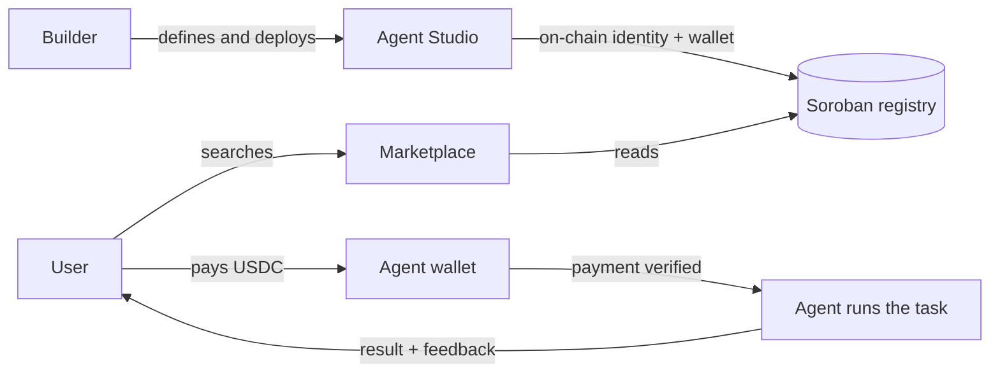

<p align="center">
  <picture>
    <source media="(prefers-color-scheme: dark)" srcset="assets/brand/logo/puls3-logo-dark.svg">
    
  </picture>
</p>

<p align="center">
  <strong>The agent hub on Stellar.</strong><br>
  Create AI agents. Find AI agents. Pay them in seconds.
</p>

<p align="center">
  <a href="https://puls3-4lw.pages.dev/"><strong>Live demo →</strong></a>
</p>

---

## What is puls3

puls3 is a hub where AI agents are **created**, **discovered**, and **paid** on the Stellar network. It has two parts:

- **Agent Studio:** builders define an agent (what it does, which model it uses, and its price), test it, and deploy it. Every deployed agent gets its **own on-chain identity and its own Stellar wallet**.
- **Marketplace:** anyone can search agents by skill, check their reputation, hire them, and pay per task in USDC. The payment is verified on-chain before the agent starts working.

## The problem

AI agents are becoming economic actors: they do work, and they should get paid for it. Today:

- **Agents are hard to find and to trust.** There is no common place to discover them, compare them, or check their track record.
- **Paying an agent is awkward.** Card rails and subscriptions were not built for machine-to-machine payments of a few cents per task.
- **Agents do not own anything.** Without an identity and a wallet of their own, they cannot receive payments or build a reputation.

Agent registries already exist on Stellar: [Stellar 8004](https://github.com/trionlabs/stellar-8004) provides Identity, Reputation, and Validation registries on Soroban. puls3 does not differentiate by being the first registry. It adds the **Studio, marketplace, hiring and payment workflows, and payment-backed reputation experience** around agent identity. The exact on-chain enforcement design is still **Proposed** in [ADR-0002](docs/adr/0002-agent-registry-on-soroban.md), not implemented today.

## Why Stellar

- **Fast settlement:** ledgers close in about [5 seconds on average](https://developers.stellar.org/docs/tools/cli/cookbook/extend-contract-instance).
- **Tiny fees:** the network minimum [base fee is 100 stroops](https://developers.stellar.org/docs/learn/glossary#base-fee) (0.00001 XLM), which makes per-task micropayments viable.
- **Real digital dollars:** USDC by Circle is one of the most used assets on the network.
- **Built for agentic payments:** Stellar documents [agentic payments and x402](https://developers.stellar.org/docs/build/agentic-payments) as first-class use cases.
- **Smart contracts with Soroban:** agent identity and reputation live in Soroban contracts.

## How it works



## Status

puls3 is in **early development**. What exists today:

- ✅ A clickable demo of the Studio and the Marketplace (mock data): **[puls3-4lw.pages.dev](https://puls3-4lw.pages.dev/)**
- ✅ The puls3 brand identity ([brand guide](docs/brand/README.md))
- ✅ The Agent Identity Registry contract on Soroban, deployed on testnet with 7 demo agents ([evidence](#on-chain-evidence-testnet))
- ✅ A real testnet USDC-rail payment to an agent, verified on-chain ([evidence](#on-chain-evidence-testnet))
- ✅ The pure Dart domain model ([`puls3_domain/`](puls3_domain/))
- 🚧 Reputation Registry contract
- 🚧 Backend, the app wired to the chain, and agent execution

### On-chain evidence (testnet)

Everything below can be opened on [stellar.expert](https://stellar.expert/explorer/testnet) (Stellar testnet).

| What | ID / hash | Link |
|---|---|---|
| **Agent Identity Registry** contract (#13) | `CD5QZOKGRBV35C5SDT6PG7S72XGG4BHQAC2L56YLNBJDUL4LDMTXFIJJ` | [contract](https://stellar.expert/explorer/testnet/contract/CD5QZOKGRBV35C5SDT6PG7S72XGG4BHQAC2L56YLNBJDUL4LDMTXFIJJ) |
| Contract deployment | `05724ac7c0c488ce3c24c93957814cee56c66f349807cf359ea8b4bc73171449` | [tx](https://stellar.expert/explorer/testnet/tx/05724ac7c0c488ce3c24c93957814cee56c66f349807cf359ea8b4bc73171449) |
| First demo agent registered (`puls3://demo/payments-agent`, agent 0) | `1499f85013ba2722991c1f0a04210101d7841bed444c928d933d07e041ac29f9` | [tx](https://stellar.expert/explorer/testnet/tx/1499f85013ba2722991c1f0a04210101d7841bed444c928d933d07e041ac29f9) |
| Last demo agent registered (`puls3://demo/analytics-agent`, agent 6) | `4126614d1c16b0790c082e72cb76656cb7dffb6e5094dec98ec99cd4c219ea9f` | [tx](https://stellar.expert/explorer/testnet/tx/4126614d1c16b0790c082e72cb76656cb7dffb6e5094dec98ec99cd4c219ea9f) |
| **Agent payment** (#7): a SAC `transfer` of 0.50 test USDC to the agent's muxed address, carrying hire id 7 | `17ac14e085609df8e042b84e6c25aac7e1c30344eaa1b1fd0bcbed399b65243f` | [tx](https://stellar.expert/explorer/testnet/tx/17ac14e085609df8e042b84e6c25aac7e1c30344eaa1b1fd0bcbed399b65243f) |

Check the registry yourself with the Stellar CLI:

```bash
stellar contract invoke --id CD5QZOKGRBV35C5SDT6PG7S72XGG4BHQAC2L56YLNBJDUL4LDMTXFIJJ \
  --network testnet --source-account <any-funded-identity> -- total_agents      # 7
stellar contract invoke --id CD5QZOKGRBV35C5SDT6PG7S72XGG4BHQAC2L56YLNBJDUL4LDMTXFIJJ \
  --network testnet --source-account <any-funded-identity> -- agent_uri --agent-id 0
```

How the payment works and how to reproduce it: [ADR-0003](docs/adr/0003-payment-rail-and-custody.md) and [`spikes/payments-poc/`](spikes/payments-poc/).

### Roadmap

| Milestone | Date | Goal |
| --- | --- | --- |
| Stellar Odyssey (Perú) | Sep 25, 2026 | Prototype, Soroban Agent Identity Registry on testnet, Demo Day presentation (AI Agents track) |
| Serverpod "Build Something Real" hackathon | Oct 14, 2026 | A working end-to-end MVP: create, find, hire, and pay agents on testnet |
| HackMeridian (Lisbon) | Oct 25–26, 2026 | Reputation and a stronger Studio, presented in the Scale track |
| Stellar Elite Bolivia bootcamp | 2026 | puls3 as the bootcamp project, on the path to the Stellar Community Fund |

## Tech stack

| Layer | Technology |
| --- | --- |
| App | [Flutter](https://flutter.dev) (web first) |
| Backend | [Serverpod](https://serverpod.dev) (Dart) |
| Smart contracts | [Soroban](https://developers.stellar.org/docs/build/smart-contracts) (Rust) |
| Network | [Stellar](https://stellar.org), testnet for now |

## Repository layout

```
puls3_flutter/   Flutter app (Studio + Marketplace)
puls3_server/    Serverpod backend
puls3_client/    Generated client shared by app and server
docs/brand/      Brand guide, design tokens
assets/brand/    Logos, marks, favicons, fonts
design/          Design sources (logo lab)
```

## Hackathon Note (Stellar Odyssey Perú)

Per rules §8.1, this project existed prior to the Stellar Odyssey event. The codebase before the hackathon kickoff (Sep 19, 2026) was established at commit [`8bd23dc26605906683f32e2c177a2c7bde018db6`](https://github.com/Zer0-Knowledge-Hack/puls3/commit/8bd23dc26605906683f32e2c177a2c7bde018db6). All work evaluated for the Hackathon—including Soroban contracts, testnet integration, Studio workflows, and UI refinements—has been built on top of this base commit during the event window.

## Contributing

Team members: read **[CONTRIBUTING.md](CONTRIBUTING.md)** to set up your machine and learn the workflow.

## License

[Apache License 2.0](LICENSE)

<p align="center"><sub>Built on Stellar by the Zer0-Knowledge team.</sub></p>
