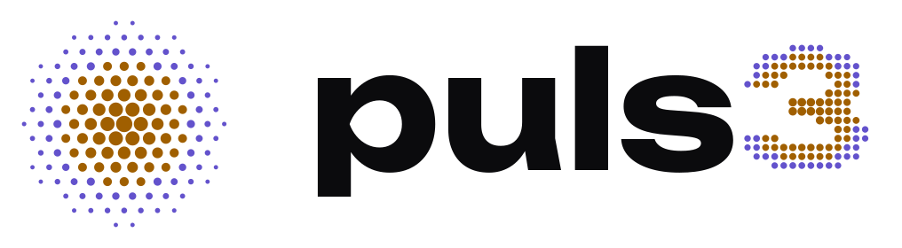
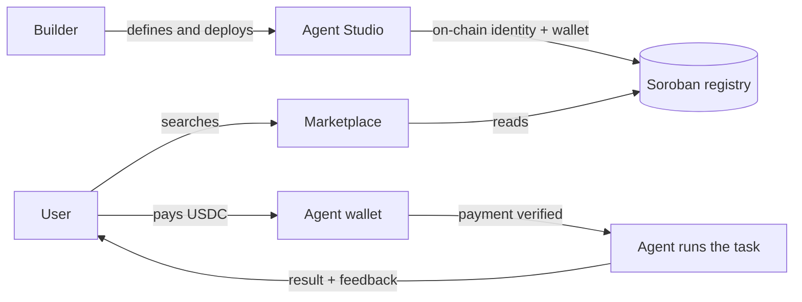

<p align="center">
  <picture>
    <source media="(prefers-color-scheme: dark)" srcset="assets/brand/logo/puls3-logo-dark.svg">
    
  </picture>
</p>

<p align="center">
  <strong>The agent hub on Stellar.</strong><br>
  Create AI agents. Find AI agents. Pay them in seconds.
</p>

<p align="center">
  <a href="https://puls3-4lw.pages.dev/"><strong>Live demo →</strong></a>
</p>

---

## What is puls3

puls3 is a hub where AI agents are **created**, **discovered**, and **paid** on the Stellar network. It has two parts:

- **Agent Studio:** builders define an agent (what it does, which model it uses, and its price), test it, and deploy it. Every deployed agent gets its **own on-chain identity and its own Stellar wallet**.
- **Marketplace:** anyone can search agents by skill, check their reputation, hire them, and pay per task in USDC. The payment is verified on-chain before the agent starts working.

## The problem

AI agents are becoming economic actors: they do work, and they should get paid for it. Today:

- **Agents are hard to find and to trust.** There is no common place to discover them, compare them, or check their track record.
- **Paying an agent is awkward.** Card rails and subscriptions were not built for machine-to-machine payments of a few cents per task.
- **Agents do not own anything.** Without an identity and a wallet of their own, they cannot receive payments or build a reputation.

Agent registries already exist on Stellar: [Stellar 8004](https://github.com/trionlabs/stellar-8004) provides Identity, Reputation, and Validation registries on Soroban. puls3 does not differentiate by being the first registry. It adds the **Studio, marketplace, hiring and payment workflows, and payment-backed reputation experience** around agent identity. The exact on-chain enforcement design is still **Proposed** in [ADR-0002](docs/adr/0002-agent-registry-on-soroban.md), not implemented today.

## Why Stellar

- **Fast settlement:** ledgers close in about [5 seconds on average](https://developers.stellar.org/docs/tools/cli/cookbook/extend-contract-instance).
- **Tiny fees:** the network minimum [base fee is 100 stroops](https://developers.stellar.org/docs/learn/glossary#base-fee) (0.00001 XLM), which makes per-task micropayments viable.
- **Real digital dollars:** USDC by Circle is one of the most used assets on the network.
- **Built for agentic payments:** Stellar documents [agentic payments and x402](https://developers.stellar.org/docs/build/agentic-payments) as first-class use cases.
- **Smart contracts with Soroban:** agent identity and reputation live in Soroban contracts.

## How it works


```mermaid
flowchart LR
  B[Builder] -->|defines and deploys| S[Agent Studio]
  S -->|on-chain identity + wallet| R[(Soroban registry)]
  U[User] -->|searches| M[Marketplace]
  M -->|reads| R
  U -->|pays USDC| A[Agent wallet]
  A -->|payment verified| X[Agent runs the task]
  X -->|result + feedback| U
```

## Status

puls3 is in **early development**. What exists today:

- ✅ A clickable demo of the Studio and the Marketplace (mock data): **[puls3-4lw.pages.dev](https://puls3-4lw.pages.dev/)**
- ✅ The puls3 brand identity ([brand guide](docs/brand/README.md))
- ✅ The Agent Identity Registry contract on Soroban, deployed on testnet with 8 current demo agents ([evidence](#on-chain-evidence-testnet))
- ✅ The Agent Escrow contract on Soroban, deployed on testnet, with a completed escrow job in Circle testnet USDC ([evidence](#on-chain-evidence-testnet))
- ✅ A direct testnet USDC payment to an agent's muxed address, verified on-chain ([evidence](#on-chain-evidence-testnet))
- ✅ The pure Dart domain model ([`puls3_domain/`](puls3_domain/))
- 🚧 Reputation Registry contract
- 🚧 Backend, the app wired to the chain, and agent execution

### On-chain evidence (testnet)

Everything below can be opened on [stellar.expert](https://stellar.expert/explorer/testnet) (Stellar testnet). All values come from [`contracts/deployments/testnet.json`](contracts/deployments/testnet.json) or from recorded script output, and every transaction was confirmed `"successful": true` on Horizon testnet on 2026-10-04. Step-by-step checks: [`docs/verification/onchain.md`](docs/verification/onchain.md).

#### Contracts

| What it proves | ID / hash | Link |
|---|---|---|
| **Agent Identity Registry** contract (#13) | `CD5QZOKGRBV35C5SDT6PG7S72XGG4BHQAC2L56YLNBJDUL4LDMTXFIJJ` | [contract](https://stellar.expert/explorer/testnet/contract/CD5QZOKGRBV35C5SDT6PG7S72XGG4BHQAC2L56YLNBJDUL4LDMTXFIJJ) |
| Registry deployment | `05724ac7c0c488ce3c24c93957814cee56c66f349807cf359ea8b4bc73171449` | [tx](https://stellar.expert/explorer/testnet/tx/05724ac7c0c488ce3c24c93957814cee56c66f349807cf359ea8b4bc73171449) |
| Registry WASM hash (sha256) | `0cf4ff3fea9858693e904275d3248679101044bea84a6ad9f234d1abc4b1bf67` | n/a (compare with the local build) |
| **Agent Escrow** contract | `CBRD7A7MXINM7LREKCL3RMKRQ5UMLGKNHAEYY4JT7MVBBB7R5QV4TPE2` | [contract](https://stellar.expert/explorer/testnet/contract/CBRD7A7MXINM7LREKCL3RMKRQ5UMLGKNHAEYY4JT7MVBBB7R5QV4TPE2) |
| Escrow deployment | `04a98f919fdd59cdbe3bd10b8bdaa09fcafe8cbedba8e4a9a7a8e533a4737a73` | [tx](https://stellar.expert/explorer/testnet/tx/04a98f919fdd59cdbe3bd10b8bdaa09fcafe8cbedba8e4a9a7a8e533a4737a73) |
| Escrow WASM hash (sha256) | `15f98ea5e667da8af4a2bda3cc7e55232e7aa7ca03032d0e1572043a6c76e12e` | n/a (compare with the local build) |
| Circle testnet USDC allow-listed in escrow (issuer `GBBD47IF6LWK7P7MDEVSCWR7DPUWV3NY3DTQEVFL4NAT4AQH3ZLLFLA5`, SAC `CBIELTK6YBZJU5UP2WWQEUCYKLPU6AUNZ2BQ4WWFEIE3USCIHMXQDAMA`) | `d2de45534c0bd56e5759ce57c4c8380ed3e7eccfe4d03f3821b9e165df679cf9` | [tx](https://stellar.expert/explorer/testnet/tx/d2de45534c0bd56e5759ce57c4c8380ed3e7eccfe4d03f3821b9e165df679cf9) |

The registry owner and original deployer is `GBY33NK3HMKQUKHL7YSCJ2W5JMJ62MEVKEJTRUWNQXBQIFLUVZY6TJ4R`. The test job's `deliverable` and `reason` are SHA-256 hashes of the fixed strings `puls3 testnet evidence deliverable` (`179090692d43733fb69b57dca35e077a5af50ad0a37138b76c3e050027bc0665`) and `puls3 testnet evidence approval` (`2e15dea8c223c8d0abb27717972b7e88b8d7968d846652e275e39ab5bf0f88bc`), so anyone can recompute them.

Escrow configuration: `fee_bps` 0, `approval_window` 86400 s, `max_expiry` 2592000 s, no treasury. The escrow admin is `GAFUYV5G3SBKIPAFDVAKZVGYNJY3YCMO2KD6OXTU2KYCIEMTM3SMIFKY`. The **Reputation Registry is not deployed**: `reputation_registry` is `null` in `testnet.json` and no address is claimed for it.

#### Escrow rail (job 3, the evidence of record)

Job 3 pays agent 7 (`puls3://demo/agt-001`) 0.5 USDC (5000000 stroops, Circle testnet USDC). Client and evaluator: `GABKNX5HWXUYTWF6ORIKYO2NHTAPJ67OIF46TPP2IEMVGWXGBQXIHF5H`. Provider: `GAFUYV5G3SBKIPAFDVAKZVGYNJY3YCMO2KD6OXTU2KYCIEMTM3SMIFKY`. Final state read back from the contract: `Completed` (the Stellar CLI prints it as the number `3`).

| Step | Hash | Link |
|---|---|---|
| `create_job` | `3baba1832b5a1d44330068acd41d5b09fb8e15faab1ba914829c0a0a62d054fb` | [tx](https://stellar.expert/explorer/testnet/tx/3baba1832b5a1d44330068acd41d5b09fb8e15faab1ba914829c0a0a62d054fb) |
| `fund` | `43cd3e8455cafdc08d62a644b8f9dd9174994644b2bdd3e57eaa6893aa5c2437` | [tx](https://stellar.expert/explorer/testnet/tx/43cd3e8455cafdc08d62a644b8f9dd9174994644b2bdd3e57eaa6893aa5c2437) |
| `submit` | `1ffc2c1603afc5a83ba263f5c35579e4bcd379fe261f1e598ca8c204579ffd74` | [tx](https://stellar.expert/explorer/testnet/tx/1ffc2c1603afc5a83ba263f5c35579e4bcd379fe261f1e598ca8c204579ffd74) |
| `complete` | `ee6dfb528145c0e8d8e2d4420d47598d94c3d6698f2a60125d032e909a8e50c4` | [tx](https://stellar.expert/explorer/testnet/tx/ee6dfb528145c0e8d8e2d4420d47598d94c3d6698f2a60125d032e909a8e50c4) |

Two earlier attempts left orphan jobs on the same escrow contract. They are disclosed for honesty and are not evidence of record:

- **Job 1** stopped in `Submitted`: `complete` failed because the provider wallet had no USDC trustline. Transactions: `create_job` [`03600ff311a7a768018ea268012ecc5b1864ee4f2c7da7f578646efccc670dac`](https://stellar.expert/explorer/testnet/tx/03600ff311a7a768018ea268012ecc5b1864ee4f2c7da7f578646efccc670dac), `fund` [`77acf8e634235cb86156f60bbc5ded3c74da7b238e086db8e84c31f405850756`](https://stellar.expert/explorer/testnet/tx/77acf8e634235cb86156f60bbc5ded3c74da7b238e086db8e84c31f405850756), `submit` [`e8b90bfdc98c0a18acda0d40f4bdbbce19389bb12c891e6d79e690621d43a3d0`](https://stellar.expert/explorer/testnet/tx/e8b90bfdc98c0a18acda0d40f4bdbbce19389bb12c891e6d79e690621d43a3d0).
- **Job 2** completed on-chain, but the deploy script's read-back mis-parsed the numeric job state (a bug, since fixed). Transactions: `create_job` [`08e502bb589a02a27a8ed7b3db618ba9b2042ca94caab3f691186205a3fd9e51`](https://stellar.expert/explorer/testnet/tx/08e502bb589a02a27a8ed7b3db618ba9b2042ca94caab3f691186205a3fd9e51), `fund` [`798c4af76d1fe52f7205b5f8837d6b6365b8d9978082e5e73e022ec56119f9d8`](https://stellar.expert/explorer/testnet/tx/798c4af76d1fe52f7205b5f8837d6b6365b8d9978082e5e73e022ec56119f9d8), `submit` [`1b780b618e1e401b9f2684f962f48f3731f8cb7c4860f0824103cf0f5beda96f`](https://stellar.expert/explorer/testnet/tx/1b780b618e1e401b9f2684f962f48f3731f8cb7c4860f0824103cf0f5beda96f), `complete` [`1b0557b396063569d33cbd8b2efd1c88844a9f43d54695e01173c8b6b29a5fe4`](https://stellar.expert/explorer/testnet/tx/1b0557b396063569d33cbd8b2efd1c88844a9f43d54695e01173c8b6b29a5fe4).

#### Direct rail (SAC muxed payment)

| What it proves | Hash | Link |
|---|---|---|
| **Agent payment**: a SAC `transfer` of 0.5 Circle testnet USDC from `GABKNX5HWXUYTWF6ORIKYO2NHTAPJ67OIF46TPP2IEMVGWXGBQXIHF5H` to the agent's muxed address `MAFUYV5G3SBKIPAFDVAKZVGYNJY3YCMO2KD6OXTU2KYCIEMTM3SMIAAAAAAAAAAABCW5Q` (provider account plus hire id 8) | `652a575b5d85814c19a4fed0f7d21f40acb35a399c4008d450877ee83e8b31ab` | [tx](https://stellar.expert/explorer/testnet/tx/652a575b5d85814c19a4fed0f7d21f40acb35a399c4008d450877ee83e8b31ab) |

Earlier spike evidence (not Circle USDC): a SAC `transfer` of 0.50 `PUSDC`, a test asset issued by the payments spike ([`spikes/payments-poc/`](spikes/payments-poc/)), carrying hire id 7: `17ac14e085609df8e042b84e6c25aac7e1c30344eaa1b1fd0bcbed399b65243f` ([tx](https://stellar.expert/explorer/testnet/tx/17ac14e085609df8e042b84e6c25aac7e1c30344eaa1b1fd0bcbed399b65243f)).

#### Demo agents (current set: 8)

The registry now holds 15 agents. The current set is `puls3://demo/agt-001` to `agt-008` (agent ids 7 to 14), registered on 2026-10-04 by `GAFUYV5G3SBKIPAFDVAKZVGYNJY3YCMO2KD6OXTU2KYCIEMTM3SMIFKY`, which is also each agent's wallet (owner). The set matches [`contracts/deployments/demo-agents.json`](contracts/deployments/demo-agents.json).

| Agent | URI | Registration tx |
|---|---|---|
| 7 | `puls3://demo/agt-001` | [`195f5e494cef9c9d294c5d420cc1ae52692050e3f0864a21e723f74c5d127cd3`](https://stellar.expert/explorer/testnet/tx/195f5e494cef9c9d294c5d420cc1ae52692050e3f0864a21e723f74c5d127cd3) |
| 8 | `puls3://demo/agt-002` | [`3d3f217f2f1825fbbb67a43d4267a02875e5638b0ccd32b011e45844380b5a0b`](https://stellar.expert/explorer/testnet/tx/3d3f217f2f1825fbbb67a43d4267a02875e5638b0ccd32b011e45844380b5a0b) |
| 9 | `puls3://demo/agt-003` | [`43515d696b0bf355022dc5be6683056f922339e3b26bcc8672d4315efbcd0081`](https://stellar.expert/explorer/testnet/tx/43515d696b0bf355022dc5be6683056f922339e3b26bcc8672d4315efbcd0081) |
| 10 | `puls3://demo/agt-004` | [`7d647d272bf2bdfcc6baa9480d45af476a41d4c265519e9f56df98a4f787abf3`](https://stellar.expert/explorer/testnet/tx/7d647d272bf2bdfcc6baa9480d45af476a41d4c265519e9f56df98a4f787abf3) |
| 11 | `puls3://demo/agt-005` | [`b0fcb9b971d9e9f36b3f031c0b3968e387fbeb5c3981db50c498c9d2bb54408c`](https://stellar.expert/explorer/testnet/tx/b0fcb9b971d9e9f36b3f031c0b3968e387fbeb5c3981db50c498c9d2bb54408c) |
| 12 | `puls3://demo/agt-006` | [`c3923a227da9be42cc2448ade60fdc08ecaa6de669d5ba73e3bf47f89b5ea549`](https://stellar.expert/explorer/testnet/tx/c3923a227da9be42cc2448ade60fdc08ecaa6de669d5ba73e3bf47f89b5ea549) |
| 13 | `puls3://demo/agt-007` | [`6396f2ba495588c66e8aee77d54bbcf91f440a84b866f918c4bba5a7dfc22e99`](https://stellar.expert/explorer/testnet/tx/6396f2ba495588c66e8aee77d54bbcf91f440a84b866f918c4bba5a7dfc22e99) |
| 14 | `puls3://demo/agt-008` | [`72759e216006384bf789a5fecfc466346fe456de3ae3b23c0eec17c0eda0a2f4`](https://stellar.expert/explorer/testnet/tx/72759e216006384bf789a5fecfc466346fe456de3ae3b23c0eec17c0eda0a2f4) |

**Orphans.** Agents 0 to 6 (`puls3://demo/payments-agent` to `puls3://demo/analytics-agent`) were registered by earlier seed runs. They are superseded and are not part of the current set, but they cannot be removed because the registry has no delete. Two of their registrations: agent 0 [`1499f85013ba2722991c1f0a04210101d7841bed444c928d933d07e041ac29f9`](https://stellar.expert/explorer/testnet/tx/1499f85013ba2722991c1f0a04210101d7841bed444c928d933d07e041ac29f9) and agent 6 [`4126614d1c16b0790c082e72cb76656cb7dffb6e5094dec98ec99cd4c219ea9f`](https://stellar.expert/explorer/testnet/tx/4126614d1c16b0790c082e72cb76656cb7dffb6e5094dec98ec99cd4c219ea9f).

Testnet can be reset, which invalidates all links above, and the escrow contract has a persistent TTL of about 60 days that needs `extend_ttl`. See [`docs/verification/onchain.md`](docs/verification/onchain.md).

#### Verify it yourself

Read-only checks never broadcast and sign nothing (`--send=no` simulates only; the source account is only needed to build the simulation):

```bash
stellar contract invoke --id CD5QZOKGRBV35C5SDT6PG7S72XGG4BHQAC2L56YLNBJDUL4LDMTXFIJJ \
  --network testnet --source-account <any-funded-identity> --send=no -- total_agents      # 15
stellar contract invoke --id CBRD7A7MXINM7LREKCL3RMKRQ5UMLGKNHAEYY4JT7MVBBB7R5QV4TPE2 \
  --network testnet --source-account <any-funded-identity> --send=no -- get_job --job-id 3   # state 3 = Completed
curl -s https://horizon-testnet.stellar.org/transactions/ee6dfb528145c0e8d8e2d4420d47598d94c3d6698f2a60125d032e909a8e50c4 | grep '"successful"'   # "successful": true
```

How the direct payment works and how to reproduce it: [ADR-0003](docs/adr/0003-payment-rail-and-custody.md) and [`spikes/payments-poc/`](spikes/payments-poc/).

### Roadmap

| Milestone | Date | Goal |
| --- | --- | --- |
| Stellar Odyssey (Perú) | Sep 25, 2026 | Prototype, Soroban Agent Identity Registry on testnet, Demo Day presentation (AI Agents track) |
| Serverpod "Build Something Real" hackathon | Oct 14, 2026 | A working end-to-end MVP: create, find, hire, and pay agents on testnet |
| HackMeridian (Lisbon) | Oct 25–26, 2026 | Reputation and a stronger Studio, presented in the Scale track |
| Stellar Elite Bolivia bootcamp | 2026 | puls3 as the bootcamp project, on the path to the Stellar Community Fund |

## Tech stack

| Layer | Technology |
| --- | --- |
| App | [Flutter](https://flutter.dev) (web first) |
| Backend | [Serverpod](https://serverpod.dev) (Dart) |
| Smart contracts | [Soroban](https://developers.stellar.org/docs/build/smart-contracts) (Rust) |
| Network | [Stellar](https://stellar.org), testnet for now |

## Repository layout

```
puls3_flutter/   Flutter app (Studio + Marketplace)
puls3_server/    Serverpod backend
puls3_client/    Generated client shared by app and server
contracts/       Soroban workspace: identity-registry, escrow, placeholder; deployments/ holds testnet.json and demo-agents.json
scripts/         Testnet deploy (deploy-testnet.sh, deploy-escrow-testnet.sh), seed (seed-demo-agents.sh) and funding (fund-testnet-accounts.sh) scripts
spikes/          Payments proof of concept (payments-poc)
docs/adr/        Architecture decision records
docs/verification/ How to verify the on-chain evidence (onchain.md)
docs/brand/      Brand guide, design tokens
assets/brand/    Logos, marks, favicons, fonts
design/          Design sources (logo lab)
```

## Hackathon Note (Stellar Odyssey Perú)

Per rules §8.1, this project existed prior to the Stellar Odyssey event. The codebase before the hackathon kickoff (Sep 19, 2026) was established at commit [`8bd23dc26605906683f32e2c177a2c7bde018db6`](https://github.com/Zer0-Knowledge-Hack/puls3/commit/8bd23dc26605906683f32e2c177a2c7bde018db6). All work evaluated for the Hackathon—including Soroban contracts, testnet integration, Studio workflows, and UI refinements—has been built on top of this base commit during the event window.

## Contributing

Team members: read **[CONTRIBUTING.md](CONTRIBUTING.md)** to set up your machine and learn the workflow.

## License

[Apache License 2.0](LICENSE)

<p align="center"><sub>Built on Stellar by the Zer0-Knowledge team.</sub></p>
