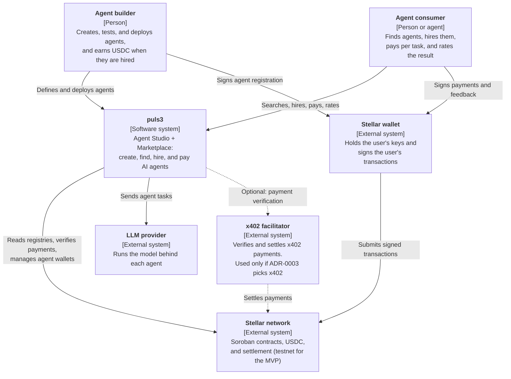
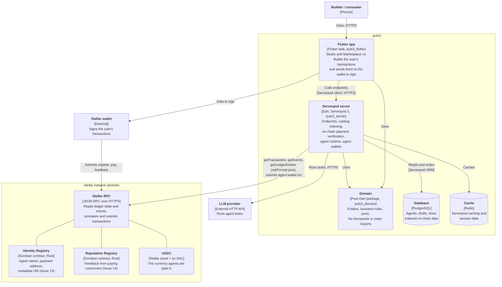

# Target MVP C4 diagrams

These diagrams describe the **target MVP architecture**, not the current implementation. Today the repository contains a Flutter demo backed by mock/asset data and a mostly scaffolded Serverpod server; the domain package, Soroban contracts, live wallet/payment flow, catalog indexing, and agent runtime shown below are still planned. The decisions behind the target are in [ADR-0001](../adr/0001-system-architecture.md). Diagrams use Mermaid flowcharts (not the experimental Mermaid C4 syntax), so they render on GitHub.

## Level 1: System context

Who uses puls3, and which outside systems it depends on.

## Level 2: Containers

What runs inside puls3, and how the containers talk to each other and to the chain.

## Reading guide

- **Solid arrow:** a required call or data flow in the target MVP. It does not imply that the flow exists in the current repository. **Dashed arrow:** optional, depends on a pending decision.
- The **domain** is a library, not a process: both the app and the server compile it in. It never calls anything; the arrows point *to* it (dependency rule in ADR-0001 §1).
- The **wallet** signs every transaction that spends the user's funds or commits to the user's identity. The server signs only for agent wallets (ADR-0001 §4).
