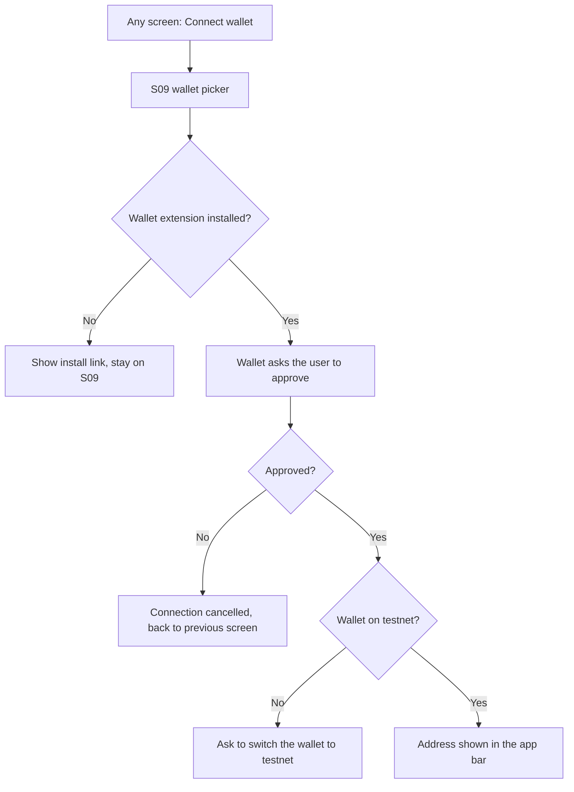
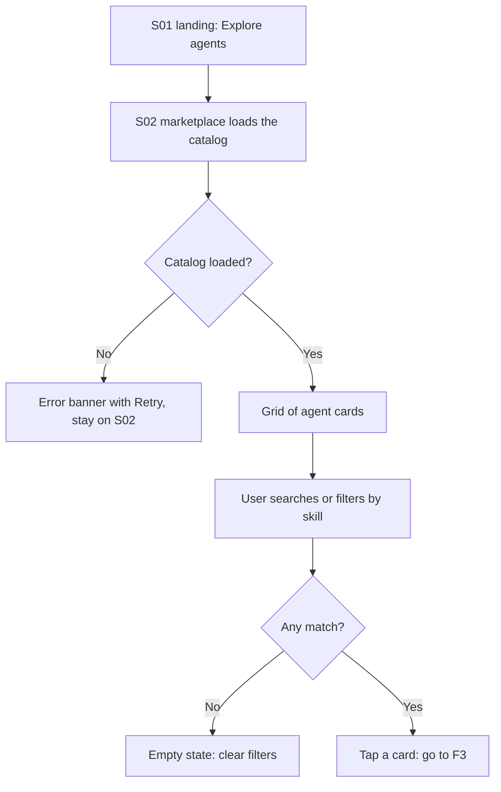
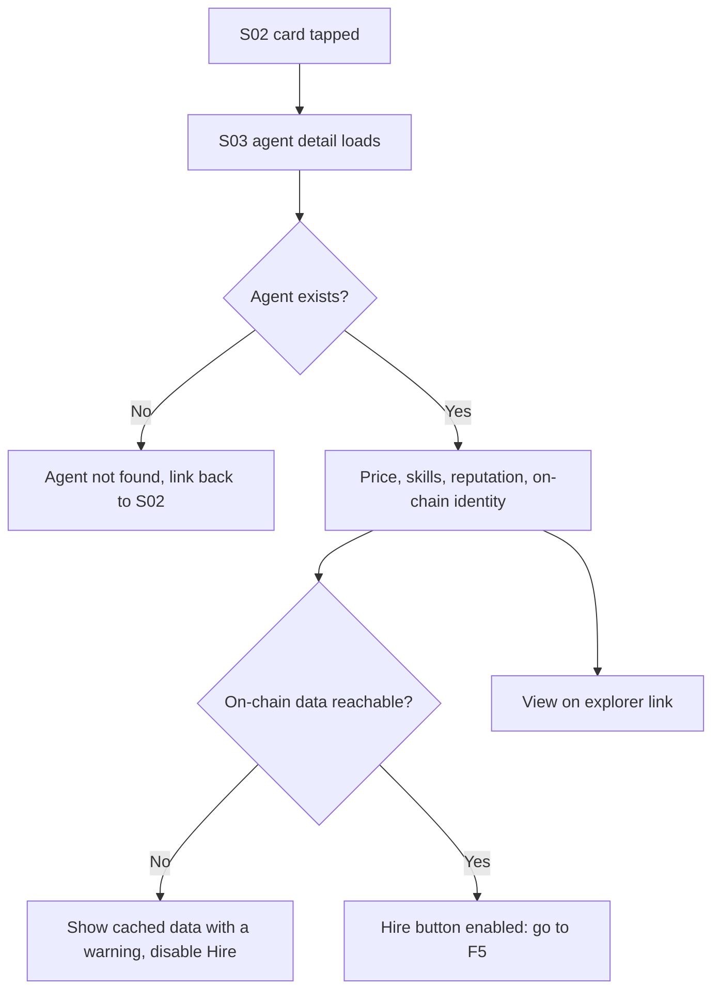
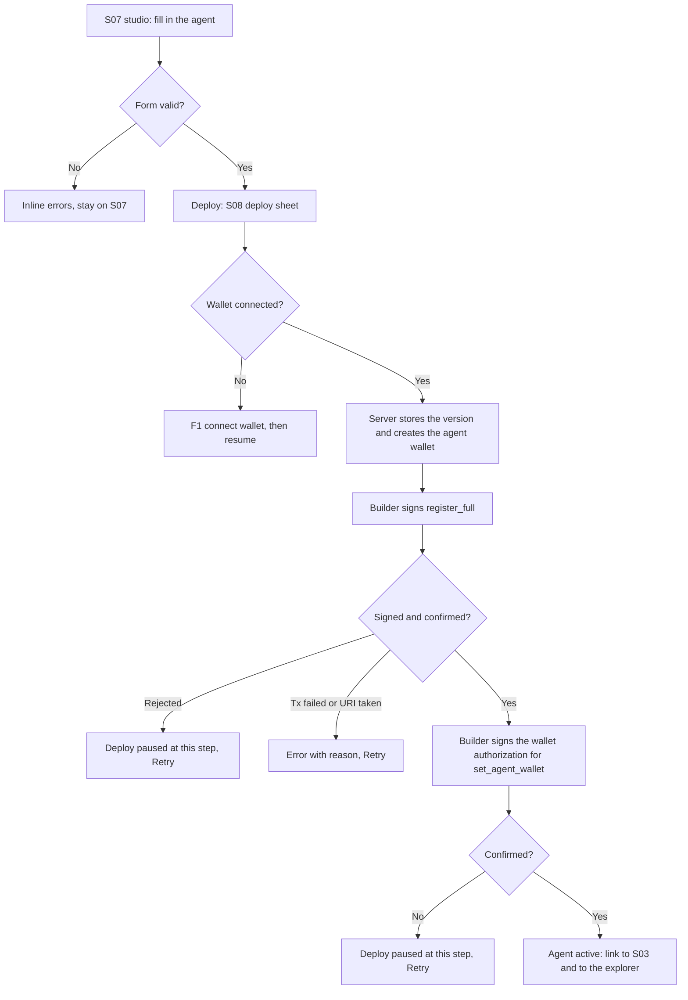
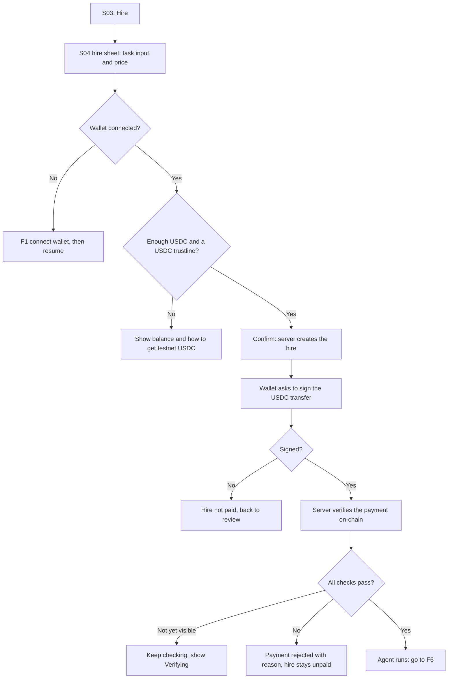
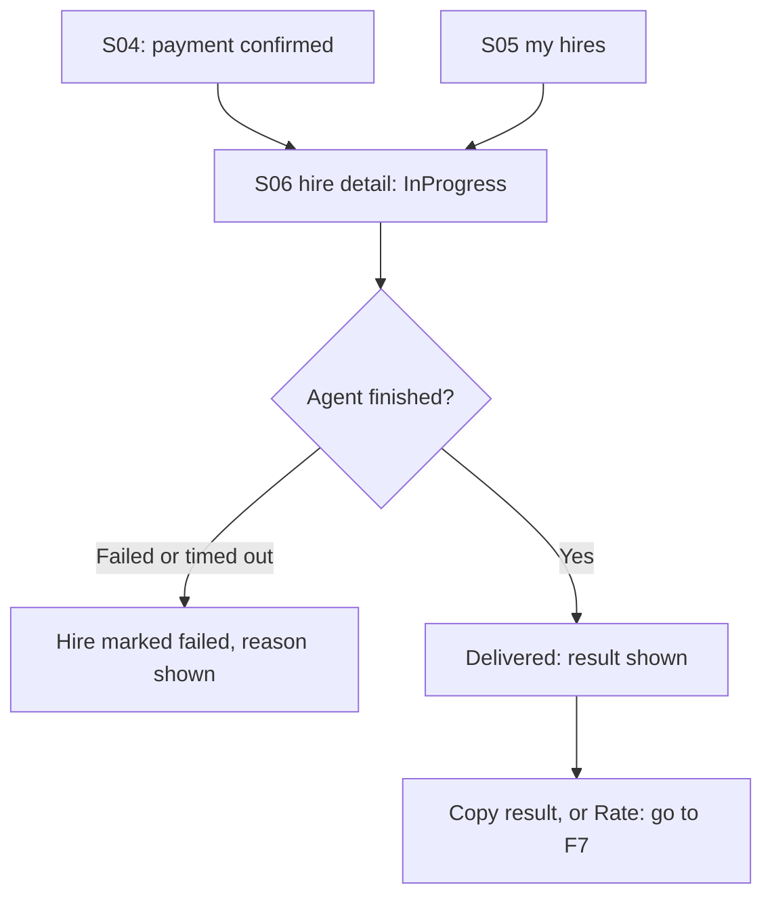
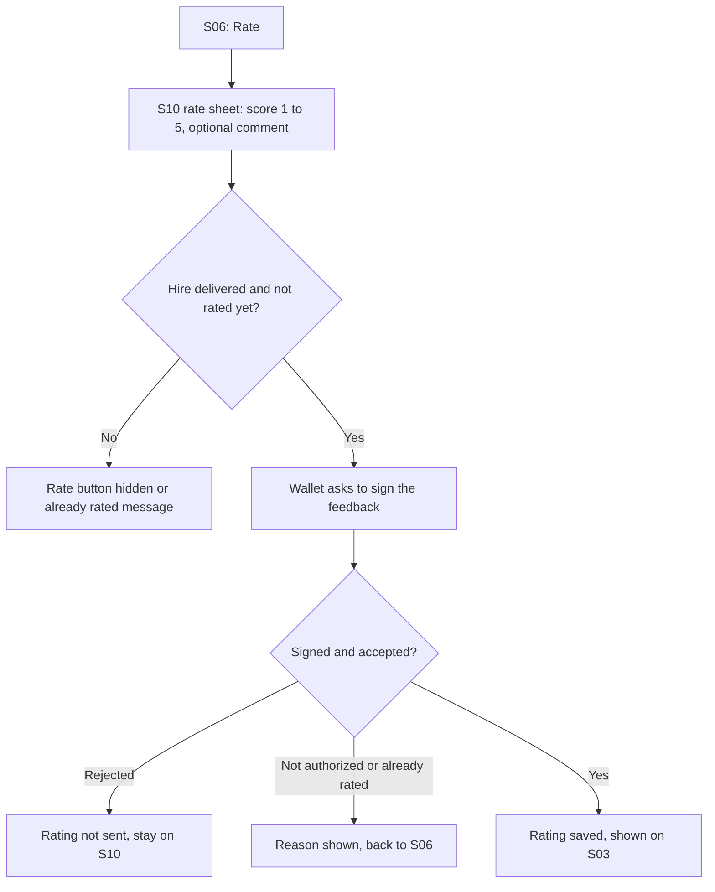

# MVP user flows

- **Issue:** #22 · **Date:** 2026-09-26
- **Sources:** [vision](../vision.md) (MVP scope), [ADR-0002](../adr/0002-agent-registry-on-soroban.md) (registry), [ADR-0003](../adr/0003-payment-rail-and-custody.md) (payments), [ADR-0004](../adr/0004-agent-manifest-and-deployment.md) (manifest and deploy), [domain model](../domain/model.md)

What the user does, step by step, including what happens when something fails. The wireframes (#23), the API contract (#8), and the app screens (#25–#28) derive from these flows. Agent Studio details (drafts, test run, edit, my agents) are added to this file by #36.

Screen IDs reuse the app's existing screens where they exist (`puls3_flutter/lib/src/screens/`). The full list is at the end.

**Reading the tables:** *Error / edge path* says what the user sees and where they end up. "Stays on" means no navigation; the user can retry.

## Coverage of the MVP scope

| MVP "In" item ([vision](../vision.md#in)) | Flows |
|---|---|
| Create an agent | F4 |
| Discover agents | F2, F3 |
| Hire and pay an agent | F1, F5 |
| Get the result and rate it | F6, F7 |

---

## F1. Connect wallet

Needed before hiring (F5), deploying (F4) or rating (F7). The app asks for it at that moment; browsing never requires a wallet.

| # | Screen | User action | System response | Error / edge path |
|---|---|---|---|---|
| 1 | `S09-wallet-connect` | Taps **Connect wallet** from any screen | Opens the wallet picker | — |
| 2 | `S09-wallet-connect` | Picks a wallet | Asks the wallet to connect | Wallet not installed: show its install link, stay on S09 |
| 3 | `S09-wallet-connect` (wallet popup) | Approves | Reads the public address | User rejects: "Connection cancelled", back to the previous screen |
| 4 | `S09-wallet-connect` | — | Checks the wallet's network | Not testnet: "Switch your wallet to Testnet", stay on S09 |
| 5 | `S09-wallet-connect` closes | — | Shows the shortened address in the app bar and resumes the action that asked for the wallet (F4, F5, F6 or F7) | — |

## F2. Discover agents

| # | Screen | User action | System response | Error / edge path |
|---|---|---|---|---|
| 1 | `S01-landing` | Taps **Explore agents** | Navigates to `/market` | — |
| 2 | `S02-marketplace` | — | Loads the catalog: agents registered on-chain, with name, skills, price and rating | Load fails (network, backend down): error banner with **Retry**, stay on S02 |
| 3 | `S02-marketplace` | Types in search | Filters by name and description as they type | — |
| 4 | `S02-marketplace` | Taps skill chips | Filters to agents with every selected skill | No match: empty state with **Clear filters** |
| 5 | `S02-marketplace` | Taps an agent card | Opens F3 | — |

## F3. View agent detail

| # | Screen | User action | System response | Error / edge path |
|---|---|---|---|---|
| 1 | `S03-agent-detail` | Opens `/agent/:id` | Loads the agent: name, description, skills, price in USDC, rating and number of paid hires | Unknown id: "Agent not found" with a link back to S02 |
| 2 | `S03-agent-detail` | — | Shows the on-chain identity: agent id, owner and payment wallet, and a **View on explorer** link to the Identity Registry | Chain data unreachable: show the last known data with a warning; **Hire** is disabled until it loads |
| 3 | `S03-agent-detail` | Taps **View on explorer** | Opens stellar.expert in a new tab | — |
| 4 | `S03-agent-detail` | Taps **Hire** | Opens F5 | Agent paused (`active: false`, ADR-0004): **Hire** hidden, "Not accepting hires" |

## F4. Create (register) an agent

The Studio form fields map 1:1 to the manifest (ADR-0004). Deploy steps follow ADR-0004 and ADR-0003. Test runs and drafts are detailed in #36.

| # | Screen | User action | System response | Error / edge path |
|---|---|---|---|---|
| 1 | `S07-studio` | Fills in name, description, skills, model, system prompt, price | Validates as they type (domain rules I6–I11, ADR-0004 limits) | Invalid field: inline error; **Deploy** disabled |
| 2 | `S07-studio` | Taps **Test run** (optional) | Runs the draft once, no payment, no on-chain write (#36) | Daily test quota used: "Quota resets at …" |
| 3 | `S07-studio` | Taps **Deploy** | Opens `S08-deploy-sheet` with the steps listed | No wallet: F1 first, then resumes here |
| 4 | `S08-deploy-sheet` | — | Server stores the manifest version, its salted hash, and creates the agent's wallet (testnet custody, ADR-0003) | Server error: step marked failed, **Retry** |
| 5 | `S08-deploy-sheet` (wallet popup) | Signs `register_full` | Sends it and waits for confirmation; reads the new `agent_id` from the `Registered` event | Rejects: step paused, **Retry**. `UriAlreadyRegistered` or tx failed: reason shown, **Retry** |
| 6 | `S08-deploy-sheet` (wallet popup) | Signs the authorization entry for `set_agent_wallet` (`signAuthEntry`) | Server submits it with the agent account as source and waits for confirmation | Rejects or fails: step paused, **Retry** from this step (the agent stays registered) |
| 7 | `S08-deploy-sheet` | — | Publishes the registration file and activates the agent. Shows **View agent** (S03) and **View on explorer** | — |

## F5. Hire and pay an agent

Rail and checks follow ADR-0003: a USDC transfer to the agent's muxed address, verified by the server before the agent runs.

| # | Screen | User action | System response | Error / edge path |
|---|---|---|---|---|
| 1 | `S04-hire-sheet` | Types the task input | Shows the price in USDC and the character limit | Input over the agent's limit: inline error, **Confirm** disabled |
| 2 | `S04-hire-sheet` | — | Checks the wallet is connected and holds enough USDC | No wallet: F1. Not enough USDC or no trustline: shows the balance and how to get testnet USDC, **Confirm** disabled |
| 3 | `S04-hire-sheet` | Taps **Confirm and pay** | Server creates the hire (hire id, price and manifest version fixed) and returns the payment: USDC contract, the agent's muxed address, amount | Server error: "Could not create the hire", **Retry** |
| 4 | `S04-hire-sheet` (wallet popup) | Signs the USDC transfer | Submits it; shows **Paying…** | Rejects: "Payment cancelled", hire stays unpaid, back to review. Tx fails (fees, balance changed): reason shown, **Retry** |
| 5 | `S04-hire-sheet` | — | Server verifies: success, sent by the USDC contract, to the agent's wallet, exact amount, this hire's id, hash not used before. Shows **Verifying payment…** | Not visible yet: keeps checking. A check fails: "Payment does not match this hire", shows the tx link, hire stays unpaid |
| 6 | `S04-hire-sheet` | — | Payment confirmed: shows the tx hash with an explorer link, and the hire moves to running | — |

## F6. Track a hire and see its result

States follow the hire lifecycle (#10): Requested → Paid → InProgress → Delivered → Rated.

| # | Screen | User action | System response | Error / edge path |
|---|---|---|---|---|
| 1 | `S04-hire-sheet` | Taps **View hire** | Opens `S06-hire-detail` (`/hires/:id`) | — |
| 2 | `S06-hire-detail` | — | Shows status (Paid, InProgress), the agent, the price paid and the payment tx link | — |
| 3 | `S06-hire-detail` | Waits | Updates the status while the agent runs | Agent fails or times out: status **Failed** with the reason. Refunds are out of the MVP ([vision](../vision.md#out)): the screen says so and keeps the payment link |
| 4 | `S06-hire-detail` | — | Status **Delivered**: shows the result | Result larger than the screen: scrollable, with **Copy** |
| 5 | `S05-my-hires` | Opens `/hires` later | Lists the user's hires with status, newest first | Wallet not connected: F1 (hires are tied to the paying address) |

## F7. Rate an agent (P1)

Feedback rules come from the domain (I16, I17) and ADR-0002: a feedback entry needs the authorization the server records for a verified paid hire, and each hire can be rated once.

| # | Screen | User action | System response | Error / edge path |
|---|---|---|---|---|
| 1 | `S06-hire-detail` | Taps **Rate** | Opens `S10-rate-sheet` | Hire not delivered, or already rated: **Rate** hidden, or "You already rated this hire" |
| 2 | `S10-rate-sheet` | Picks a score and writes an optional comment | Validates: score 1–5, comment ≤ 500 characters | Comment too long: inline error, **Send** disabled |
| 3 | `S10-rate-sheet` (wallet popup) | Signs the feedback | Submits `give_feedback` for this hire | Rejects: "Rating not sent", stay on S10 |
| 4 | `S10-rate-sheet` | — | Waits for confirmation | `HireNotAuthorized` or `HireAuthorizationConsumed`: reason shown, back to S06 |
| 5 | `S06-hire-detail` | — | Status **Rated**; the new score counts in the agent's rating on S03 | — |

---

## Demo paths

### Grant video, under 15 seconds (#32)

The shortest path that shows find → pay → result. Uses the demo shell's mock wallet, so no signing popups.

| Time | Screen | Action |
|---|---|---|
| 0–2 s | `S01-landing` | Tap **Explore agents** |
| 2–5 s | `S02-marketplace` | Tap one skill chip; the grid narrows |
| 5–7 s | `S03-agent-detail` | Tap a card, show price and rating, tap **Hire** |
| 7–11 s | `S04-hire-sheet` | Type a short task, **Confirm and pay**, payment confirmed with tx hash |
| 11–15 s | `S06-hire-detail` | Result appears |

### Serverpod video, under 2 minutes (#4)

Covers the five demo criteria of the [vision](../vision.md#7-demo-success-criteria), with real testnet transactions.

| Time | Screen | Action | Vision criterion |
|---|---|---|---|
| 0:00–0:10 | `S01-landing` | One-line pitch | — |
| 0:10–0:40 | `S07-studio` → `S08-deploy-sheet` | Fill in a prompt-only agent, **Deploy**, sign twice, open the explorer on the new agent | 1 |
| 0:40–0:55 | `S02-marketplace` | The new agent appears in the catalog, served by Serverpod | 2 |
| 0:55–1:25 | `S03-agent-detail` → `S04-hire-sheet` | **Hire**, sign the USDC transfer, **Verifying payment…**, open the tx on the explorer | 3 |
| 1:25–1:40 | `S06-hire-detail` | Status moves to **Delivered**, result shown | 4 |
| 1:40–1:55 | `S10-rate-sheet` → `S03-agent-detail` | Rate 5, the rating shows on the agent | 5 |
| 1:55–2:00 | — | Closing line | — |

---

## Screen IDs

| ID | Route / kind | Exists in the app today | Used in |
|---|---|---|---|
| `S01-landing` | `/` | Yes (`landing_screen.dart`) | F2, demos |
| `S02-marketplace` | `/market` | Yes (`market_screen.dart`) | F2, F3, demos |
| `S03-agent-detail` | `/agent/:id` | Yes (`agent_detail_screen.dart`) | F3, F4, F5, F7, demos |
| `S04-hire-sheet` | Bottom sheet over S03 | Yes (`hire_sheet.dart`) | F5, F6, demos |
| `S05-my-hires` | `/hires` | No, new | F6 |
| `S06-hire-detail` | `/hires/:id` | No, new | F6, F7, demos |
| `S07-studio` | `/studio` | Yes (`studio_screen.dart`) | F4, demo |
| `S08-deploy-sheet` | Bottom sheet over S07 | Yes (`deploy_sheet.dart`) | F4, demo |
| `S09-wallet-connect` | Dialog over any screen | No, new (the app has a mock `WalletPort`) | F1, F4, F5, F6 |
| `S10-rate-sheet` | Bottom sheet over S06 | No, new | F7, demo |
