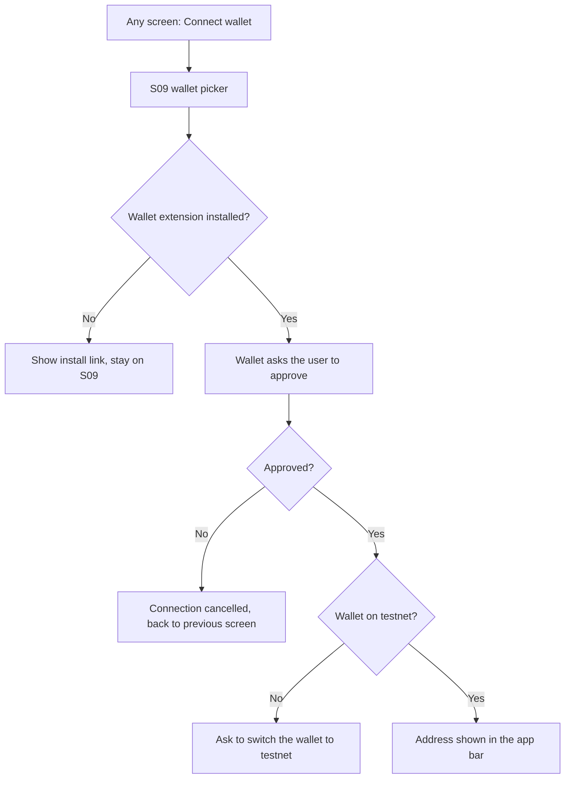
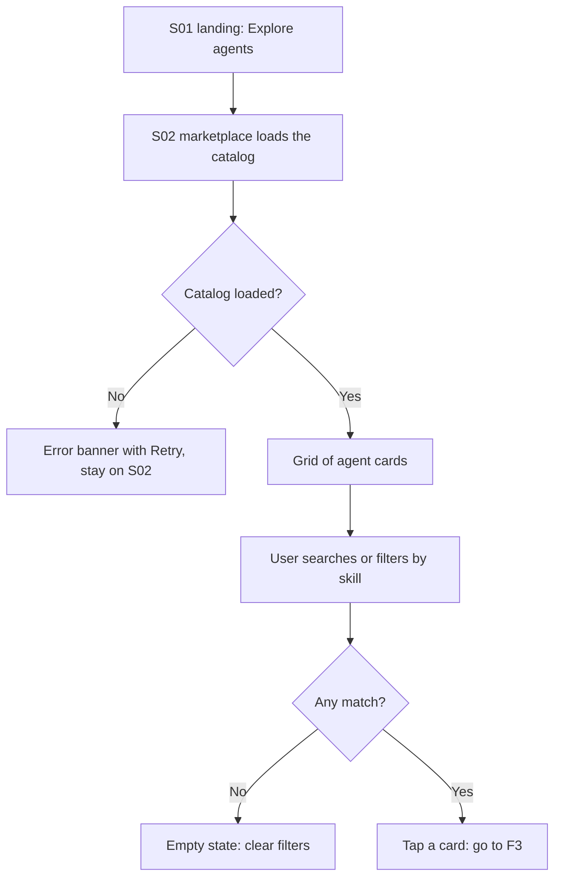
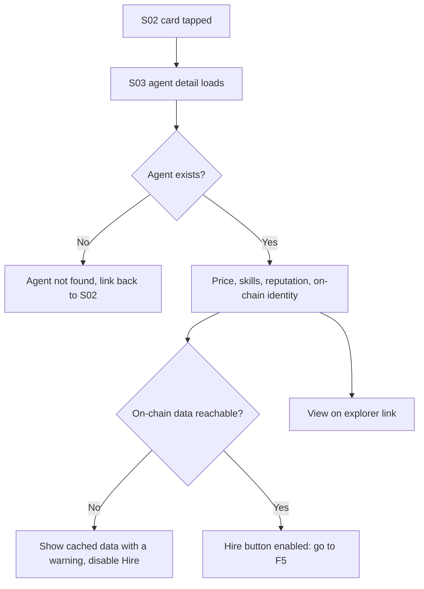
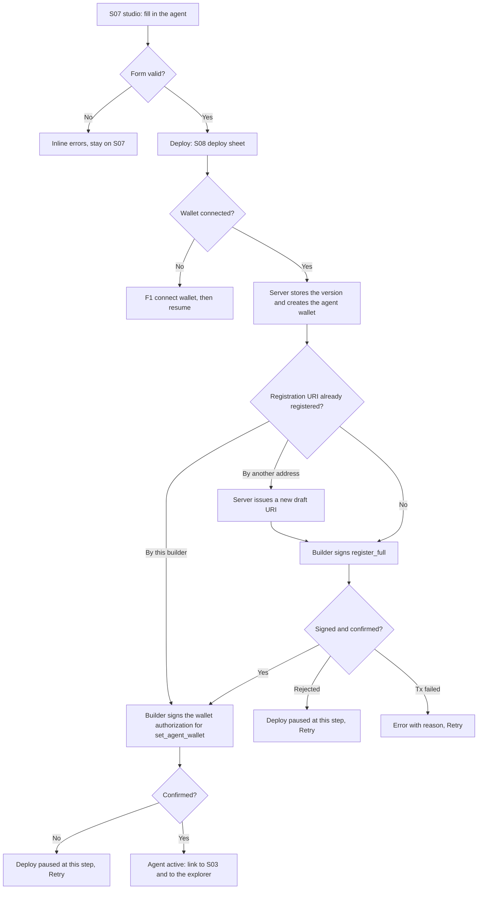
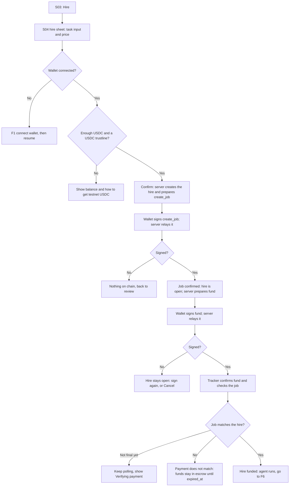
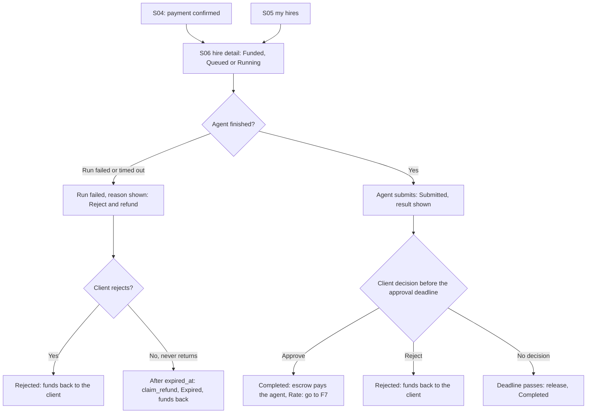
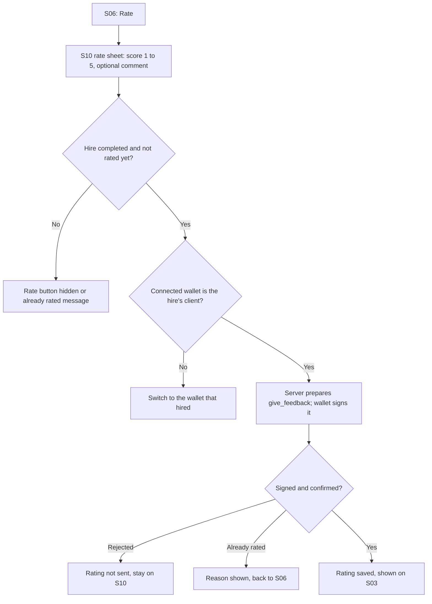

# MVP user flows

- **Issues:** #22, #76 · **Date:** 2026-09-26 · **Updated:** 2026-10-08 (ADR-0005 escrow and hire states)
- **Sources:** [vision](../vision.md) (MVP scope), [ADR-0002](../adr/0002-agent-registry-on-soroban.md) (registry), [ADR-0003](../adr/0003-payment-rail-and-custody.md) (custody), [ADR-0004](../adr/0004-agent-manifest-and-deployment.md) (manifest and deploy), [ADR-0005](../adr/0005-align-agent-commerce-with-erc-8183-and-erc-8004.md) (escrow, hire states, feedback), [API contract](../architecture/api.md), [domain model](../domain/model.md)

What the user does, step by step, including what happens when something fails. The wireframes (#23), the API contract (#8), and the app screens (#25–#28) derive from these flows. Agent Studio details (drafts, test run, edit, my agents) are added to this file by #36.

Screen IDs reuse the app's existing screens where they exist (`puls3_flutter/lib/src/screens/`). The full list is at the end.

**Reading the tables:** *Error / edge path* says what the user sees and where they end up. "Stays on" means no navigation; the user can retry.

## Coverage of the MVP scope

| MVP "In" item ([vision](../vision.md#in)) | Flows |
|---|---|
| Create an agent | F4 |
| Discover agents | F2, F3 |
| Hire and pay an agent | F1, F5 |
| Get the result and rate it | F6, F7 |

---

## F1. Connect wallet

Needed before hiring (F5), deploying (F4) or rating (F7). The app asks for it at that moment; browsing never requires a wallet.

```mermaid
flowchart TD
  A["Any screen: Connect wallet"] --> B["S09 wallet picker"]
  B --> C{"Wallet extension installed?"}
  C -- No --> C1["Show install link, stay on S09"]
  C -- Yes --> D["Wallet asks the user to approve"]
  D --> E{"Approved?"}
  E -- No --> E1["Connection cancelled, back to previous screen"]
  E -- Yes --> F{"Wallet on testnet?"}
  F -- No --> F1["Ask to switch the wallet to testnet"]
  F -- Yes --> G["Address shown in the app bar"]
```

| # | Screen | User action | System response | Error / edge path |
|---|---|---|---|---|
| 1 | `S09-wallet-connect` | Taps **Connect wallet** from any screen | Opens the wallet picker | — |
| 2 | `S09-wallet-connect` | Picks a wallet | Asks the wallet to connect | Wallet not installed: show its install link, stay on S09 |
| 3 | `S09-wallet-connect` (wallet popup) | Approves | Reads the public address | User rejects: "Connection cancelled", back to the previous screen |
| 4 | `S09-wallet-connect` | — | Checks the wallet's network | Not testnet: "Switch your wallet to Testnet", stay on S09 |
| 5 | `S09-wallet-connect` closes | — | Shows the shortened address in the app bar and resumes the action that asked for the wallet (F4, F5, F6 or F7) | — |

## F2. Discover agents

```mermaid
flowchart TD
  A["S01 landing: Explore agents"] --> B["S02 marketplace loads the catalog"]
  B --> C{"Catalog loaded?"}
  C -- No --> C1["Error banner with Retry, stay on S02"]
  C -- Yes --> D["Grid of agent cards"]
  D --> E["User searches or filters by skill"]
  E --> F{"Any match?"}
  F -- No --> F1["Empty state: clear filters"]
  F -- Yes --> G["Tap a card: go to F3"]
```

| # | Screen | User action | System response | Error / edge path |
|---|---|---|---|---|
| 1 | `S01-landing` | Taps **Explore agents** | Navigates to `/market` | — |
| 2 | `S02-marketplace` | — | Loads the catalog: agents registered on-chain, with name, skills, price and rating | Load fails (network, backend down): error banner with **Retry**, stay on S02 |
| 3 | `S02-marketplace` | Types in search | Filters by name and description as they type | — |
| 4 | `S02-marketplace` | Taps skill chips | Filters to agents with every selected skill | No match: empty state with **Clear filters** |
| 5 | `S02-marketplace` | Taps an agent card | Opens F3 | — |

## F3. View agent detail

```mermaid
flowchart TD
  A["S02 card tapped"] --> B["S03 agent detail loads"]
  B --> C{"Agent exists?"}
  C -- No --> C1["Agent not found, link back to S02"]
  C -- Yes --> D["Price, skills, reputation, on-chain identity"]
  D --> E{"On-chain data reachable?"}
  E -- No --> E1["Show cached data with a warning, disable Hire"]
  E -- Yes --> F["Hire button enabled: go to F5"]
  D --> G["View on explorer link"]
```

| # | Screen | User action | System response | Error / edge path |
|---|---|---|---|---|
| 1 | `S03-agent-detail` | Opens `/agent/:id` | Loads the agent: name, description, skills, price in USDC, rating and number of paid hires | Unknown id: "Agent not found" with a link back to S02 |
| 2 | `S03-agent-detail` | — | Shows the on-chain identity: agent id, owner and payment wallet, and a **View on explorer** link to the Identity Registry | Chain data unreachable: show the last known data with a warning; **Hire** is disabled until it loads |
| 3 | `S03-agent-detail` | Taps **View on explorer** | Opens stellar.expert in a new tab | — |
| 4 | `S03-agent-detail` | Taps **Hire** | Opens F5 | Agent paused (`active: false`, ADR-0004): **Hire** hidden, "Not accepting hires" |

## F4. Create (register) an agent

The Studio form fields map 1:1 to the manifest (ADR-0004): name, description, skills, model, system prompt, input (type and maximum characters), output (type and maximum characters), and price. Deploy steps follow ADR-0004 and ADR-0003. Test runs and drafts are detailed in #36.

**Registration URI.** The server gives every Studio draft its own registration URI (the URL of the agent's public registration file, ADR-0004), built from a server-generated draft id. Before the builder signs `register_full`, the server calls `agent_id_by_uri` on the Identity Registry:

- **Not registered:** continue with `register_full`.
- **Registered by this builder:** an earlier attempt already landed (for example, the app lost the confirmation). The deploy **resumes** with that `agent_id` at step 7; nothing is registered twice.
- **Registered by another address:** the server issues a **new draft id and URI**, rebuilds the transaction, and the builder signs it.

Retrying with an unchanged URI therefore never repeats a failing `register_full`.

```mermaid
flowchart TD
  A["S07 studio: fill in the agent"] --> B{"Form valid?"}
  B -- No --> B1["Inline errors, stay on S07"]
  B -- Yes --> C["Deploy: S08 deploy sheet"]
  C --> D{"Wallet connected?"}
  D -- No --> D1["F1 connect wallet, then resume"]
  D -- Yes --> E["Server stores the version and creates the agent wallet"]
  E --> P{"Registration URI already registered?"}
  P -- "By this builder" --> H
  P -- "By another address" --> P1["Server issues a new draft URI"]
  P1 --> F
  P -- No --> F["Builder signs register_full"]
  F --> G{"Signed and confirmed?"}
  G -- "Rejected" --> G1["Deploy paused at this step, Retry"]
  G -- "Tx failed" --> G2["Error with reason, Retry"]
  G -- Yes --> H["Builder signs the wallet authorization for set_agent_wallet"]
  H --> I{"Confirmed?"}
  I -- No --> I1["Deploy paused at this step, Retry"]
  I -- Yes --> J["Agent active: link to S03 and to the explorer"]
```

| # | Screen | User action | System response | Error / edge path |
|---|---|---|---|---|
| 1 | `S07-studio` | Fills in name, description, skills, model, system prompt, input (type, max characters), output (type, max characters) and price | Validates as they type: skills (I6, I9, I10), name (I7), description (I8), price as whole USDC stroops (I2) and greater than zero (I11), input ≤ 8,000 and output ≤ 16,000 characters (ADR-0004) | Invalid field: inline error; **Deploy** disabled |
| 2 | `S07-studio` | Taps **Test run** (optional) | Runs the draft once, no payment, no on-chain write (#36) | Daily test quota used: "Quota resets at …" |
| 3 | `S07-studio` | Taps **Deploy** | Opens `S08-deploy-sheet` with the steps listed | No wallet: F1 first, then resumes here |
| 4 | `S08-deploy-sheet` | — | Server stores the manifest version, its salted hash, and creates the agent's wallet (testnet custody, ADR-0003) | Server error: step marked failed, **Retry** |
| 5 | `S08-deploy-sheet` | — | Server checks the draft's registration URI with `agent_id_by_uri` (see **Registration URI** above) | Already registered by this builder: resume at step 7 with that `agent_id`. Registered by another address: new draft URI, then step 6 |
| 6 | `S08-deploy-sheet` (wallet popup) | Signs `register_full` | Sends it and waits for confirmation; reads the new `agent_id` from the `Registered` event | Rejects: step paused, **Retry**. Tx failed: reason shown, **Retry**. `UriAlreadyRegistered` (another deploy took the URI between step 5 and now): back to step 5, which resumes or issues a new URI |
| 7 | `S08-deploy-sheet` (wallet popup) | Signs the authorization entry for `set_agent_wallet` (`signAuthEntry`) | Server submits it with the agent account as source and waits for confirmation | Rejects or fails: step paused, **Retry** from this step (the agent stays registered) |
| 8 | `S08-deploy-sheet` | — | Publishes the registration file and activates the agent. Shows **View agent** (S03) and **View on explorer** | — |

## F5. Hire and pay an agent

A hire is an ERC-8183 escrow job ([ADR-0005](../adr/0005-align-agent-commerce-with-erc-8183-and-erc-8004.md) D1, D6):
- the consumer is the client and the evaluator;
- the agent wallet is the provider;
- the escrow holds the USDC until the job is completed, rejected or refunded.

The server prepares every envelope, the wallet signs it unchanged, and the server verifies, relays and tracks it ([API contract](../architecture/api.md#server-relay-submission), Decision A). The agent runs only once the tracker confirms `fund` and the job matches the hire ([funding verification](../architecture/api.md#funding-verification)).

```mermaid
flowchart TD
  A["S03: Hire"] --> B["S04 hire sheet: task input and price"]
  B --> C{"Wallet connected?"}
  C -- No --> C1["F1 connect wallet, then resume"]
  C -- Yes --> D{"Enough USDC and a USDC trustline?"}
  D -- No --> D1["Show balance and how to get testnet USDC"]
  D -- Yes --> E["Confirm: server creates the hire and prepares create_job"]
  E --> F["Wallet signs create_job; server relays it"]
  F --> G{"Signed?"}
  G -- No --> G1["Nothing on chain, back to review"]
  G -- Yes --> H["Job confirmed: hire is open; server prepares fund"]
  H --> I["Wallet signs fund; server relays it"]
  I --> J{"Signed?"}
  J -- No --> J1["Hire stays open: sign again, or Cancel"]
  J -- Yes --> K["Tracker confirms fund and checks the job"]
  K --> L{"Job matches the hire?"}
  L -- "Not final yet" --> L1["Keep polling, show Verifying payment"]
  L -- No --> L2["Payment does not match: funds stay in escrow until expired_at"]
  L -- Yes --> M["Hire funded: agent runs, go to F6"]
```

| # | Screen | User action | System response | Error / edge path |
|---|---|---|---|---|
| 1 | `S04-hire-sheet` | Types the task input | Shows the price in USDC, the character limit, and that the payment is held in escrow until the client approves the result | Input over the agent's limit: inline error, **Confirm** disabled. The server checks it again (`InputTooLong`) |
| 2 | `S04-hire-sheet` | — | Checks the wallet is connected and holds enough USDC | No wallet: F1. Not enough USDC or no trustline: shows the balance and how to get testnet USDC, **Confirm** disabled |
| 3 | `S04-hire-sheet` | Taps **Confirm and pay** | Server creates the hire record (agent, price and manifest version fixed) and returns the unsigned `create_job` envelope. In it, the consumer is the client and the evaluator, the agent wallet is the provider, the hire price is the budget, and the server sets `expired_at` | Server error: "Could not create the hire", **Retry** (same request id, so no duplicate hire) |
| 4 | `S04-hire-sheet` (wallet popup) | Signs `create_job` | Server verifies the signed envelope against what it prepared, relays it, and shows **Creating the job…** until the tracker confirms it. The hire is then `open` | Rejects: nothing reaches the chain, back to review. Preparation expired or rejected: the app asks for a new one and the user signs again |
| 5 | `S04-hire-sheet` (wallet popup) | Signs `fund` | Server prepares `fund` (budget = hire price, the client's maximum fee), verifies and relays the signed envelope, and shows **Verifying payment…** while it polls | Rejects: hire stays `open`; the user can sign again or **Cancel** (step 7). Tx fails (balance changed, fees): reason shown, sign again |
| 6 | `S04-hire-sheet` | — | Tracker confirms `fund` and reads the job: state `Funded`, client and evaluator = consumer, provider = agent wallet, USDC token, budget = price, `expired_at` as prepared. The hire becomes `funded`, the `fund` transaction is shown with an explorer link, and the agent run is queued | Job does not match the hire (`JobMismatch`, `JobEvidenceUnavailable`): "Payment does not match this hire", with the tx link. The funds stay in the escrow and return through `claim_refund` after `expired_at` |
| 7 | `S04-hire-sheet` | Taps **Cancel** on an `open` hire | Server prepares `reject` from `open`; the wallet signs it and the server relays it. The hire becomes `rejected` (from `open`), shown as **Cancelled**. No funds were held, so nothing is refunded | Rejects: hire stays `open`. An unfunded hire past `expired_at` is shown as **Expired**, with no transaction |

## F6. Track a hire, see its result and approve it

Hire states follow ADR-0005 D6 ([hire lifecycle](../domain/hire-lifecycle.md)):
- the hire states are `open`, `funded`, `submitted`, `completed`, `rejected` and `expired`;
- the hire stays `funded` while the agent works;
- runtime progress (`queued`, `running`, `failed`) is separate data shown alongside it.

```mermaid
flowchart TD
  A["S04: payment confirmed"] --> B["S06 hire detail: Funded, Queued or Running"]
  B --> C{"Agent finished?"}
  C -- "Run failed or timed out" --> C1["Run failed, reason shown: Reject and refund"]
  C1 --> R1{"Client rejects?"}
  R1 -- Yes --> R2["Rejected: funds back to the client"]
  R1 -- "No, never returns" --> R3["After expired_at: claim_refund, Expired, funds back"]
  C -- Yes --> D["Agent submits: Submitted, result shown"]
  D --> E{"Client decision before the approval deadline"}
  E -- Approve --> F["Completed: escrow pays the agent, Rate: go to F7"]
  E -- Reject --> G["Rejected: funds back to the client"]
  E -- "No decision" --> H["Deadline passes: release, Completed"]
  S["S05 my hires"] --> B
```

| # | Screen | User action | System response | Error / edge path |
|---|---|---|---|---|
| 1 | `S04-hire-sheet` | Taps **View hire** | Opens `S06-hire-detail` (`/hires/:id`) | — |
| 2 | `S06-hire-detail` | — | Shows the status (**Funded**), the run progress (**Queued**, **Running**), the agent, the price held in escrow and the `fund` tx link | — |
| 3 | `S06-hire-detail` | Waits | Polls the hire while the agent runs. On success the agent account signs `submit` (server-signed), and once it is confirmed the hire is **Submitted** with the result | Run fails or times out: the status stays **Funded**, the run shows **Failed** with the reason, and **Reject and refund** is offered (step 5). If the client never acts, the tracker calls `claim_refund` after `expired_at` and the hire becomes **Expired**, with the funds back to the client and the refund tx linked |
| 4 | `S06-hire-detail` | Reads the result, taps **Approve** | Shows the result and the time left until the approval deadline. **Approve** prepares `complete`; the wallet signs and the server relays it. The hire becomes **Completed**, and the escrow pays the agent | Result larger than the screen: scrollable, with **Copy**. No decision before the deadline: the tracker calls the permissionless `release` and the hire becomes **Completed** (silence approves, D4). The countdown UI is planned by HackMeridian (D2) and the window length is deferred (D3) |
| 5 | `S06-hire-detail` | Taps **Reject** (with an optional reason) | Prepares `reject`; the wallet signs and the server relays it. The hire becomes **Rejected**, the funds return to the client, and the refund tx is linked | After the approval deadline, **Reject** is hidden: the escrow refuses it. A reject is final: there are no disputes in the MVP (D8). Only rejects of submitted work count against the client |
| 6 | `S05-my-hires` | Opens `/hires` later | Lists the user's hires with status and run progress, newest first. A reject from `open` is labeled **Cancelled** | Wallet not connected: F1 (hires are tied to the client address) |

## F7. Rate an agent (P1)

Feedback rules come from the domain (I16, I17, I20) and ADR-0005 D5:
- **The registry.** The Reputation Registry is a Stellar 8004 drop-in, with no `authorize_feedback` step.
- **Who can rate.** The paid-hire rule is proven by a completed escrow job. Readers count feedback only from clients with completed jobs.
- **What the hire keeps.** A rating is not a hire state: the hire keeps a reference to the confirmed feedback, and each hire is rated once.

```mermaid
flowchart TD
  A["S06: Rate"] --> B["S10 rate sheet: score 1 to 5, optional comment"]
  B --> C{"Hire completed and not rated yet?"}
  C -- No --> C1["Rate button hidden or already rated message"]
  C -- Yes --> K{"Connected wallet is the hire's client?"}
  K -- No --> K1["Switch to the wallet that hired"]
  K -- Yes --> D["Server prepares give_feedback; wallet signs it"]
  D --> E{"Signed and confirmed?"}
  E -- "Rejected" --> E1["Rating not sent, stay on S10"]
  E -- "Already rated" --> E2["Reason shown, back to S06"]
  E -- Yes --> F["Rating saved, shown on S03"]
```

| # | Screen | User action | System response | Error / edge path |
|---|---|---|---|---|
| 1 | `S06-hire-detail` | Taps **Rate** | Opens `S10-rate-sheet`. **Rate** shows only on a **Completed** hire with no rating yet | Hire not completed, or already rated: **Rate** hidden, or "You already rated this hire" |
| 2 | `S10-rate-sheet` | — | Checks, without side effects, that the connected wallet is the hire's client and the hire is completed | Another wallet connected: "Rate with the wallet that hired" |
| 3 | `S10-rate-sheet` | Picks a score and writes an optional comment | Validates: score 1–5, comment ≤ 500 characters. The server validates again and prepares `give_feedback` with the client as source | Comment too long: inline error, **Send** disabled |
| 4 | `S10-rate-sheet` (wallet popup) | Signs the feedback | Server verifies the signed envelope against what it prepared, relays it and tracks it | Rejects: "Rating not sent", stay on S10 |
| 5 | `S10-rate-sheet` | — | Polls until the feedback is confirmed | `HireAlreadyRated`: "You already rated this hire", back to S06 |
| 6 | `S06-hire-detail` | — | The hire stays **Completed** and shows the rating. The new score counts in the agent's rating on S03 (served once #21 lands) | — |

---

## Demo paths

### Grant video, under 15 seconds (#32)

The shortest path that shows find → pay → result. Uses the demo shell's mock wallet, so no signing popups.

| Time | Screen | Action |
|---|---|---|
| 0–2 s | `S01-landing` | Tap **Explore agents** |
| 2–5 s | `S02-marketplace` | Tap one skill chip; the grid narrows |
| 5–7 s | `S03-agent-detail` | Tap a card, show price and rating, tap **Hire** |
| 7–11 s | `S04-hire-sheet` | Type a short task, **Confirm and pay**, funds held in escrow with the tx hash |
| 11–15 s | `S06-hire-detail` | Result appears, **Approve** |

### Serverpod video, under 2 minutes (#4)

Covers the five demo criteria of the [vision](../vision.md#7-demo-success-criteria), with real testnet transactions.

| Time | Screen | Action | Vision criterion |
|---|---|---|---|
| 0:00–0:10 | `S01-landing` | One-line pitch | — |
| 0:10–0:40 | `S07-studio` → `S08-deploy-sheet` | Fill in a prompt-only agent, **Deploy**, sign twice, open the explorer on the new agent | 1 |
| 0:40–0:55 | `S02-marketplace` | The new agent appears in the catalog, served by Serverpod | 2 |
| 0:55–1:25 | `S03-agent-detail` → `S04-hire-sheet` | **Hire**, sign `create_job` and `fund`, **Verifying payment…**, open the `fund` tx on the explorer: the USDC is held by the escrow | 3 |
| 1:25–1:40 | `S06-hire-detail` | **Funded**, run **Running**, then **Submitted** with the result; **Approve** and the hire is **Completed** (the escrow pays the agent) | 4 |
| 1:40–1:55 | `S10-rate-sheet` → `S03-agent-detail` | Rate 5, the rating shows on the agent | 5 |
| 1:55–2:00 | — | Closing line | — |

---

## Screen IDs

| ID | Route / kind | Exists in the app today | Used in |
|---|---|---|---|
| `S01-landing` | `/` | Yes (`landing_screen.dart`) | F2, demos |
| `S02-marketplace` | `/market` | Yes (`market_screen.dart`) | F2, F3, demos |
| `S03-agent-detail` | `/agent/:id` | Yes (`agent_detail_screen.dart`) | F3, F4, F5, F7, demos |
| `S04-hire-sheet` | Bottom sheet over S03 | Yes (`hire_sheet.dart`) | F5, F6, demos |
| `S05-my-hires` | `/hires` | No, new | F6 |
| `S06-hire-detail` | `/hires/:id` | No, new | F6, F7, demos |
| `S07-studio` | `/studio` | Yes (`studio_screen.dart`) | F4, demo |
| `S08-deploy-sheet` | Bottom sheet over S07 | Yes (`deploy_sheet.dart`) | F4, demo |
| `S09-wallet-connect` | Dialog over any screen | No, new (the app has a mock `WalletPort`) | F1, F4, F5, F6 |
| `S10-rate-sheet` | Bottom sheet over S06 | No, new | F7, demo |
