# puls3 · Brand Guidelines 2026

The written companion to [`puls3-brand-guide.pdf`](puls3-brand-guide.pdf). Each section shows the page from the guide, then its rules. Tokens live in [`tokens.json`](tokens.json); final assets live in [`/assets/brand`](../../assets/brand).

> Status: v1.0 draft for review. Source: `design/logo-lab` (Remotion). Rebuild with `npm run brand:render && npm run brand:export && npm run brand:pdf`.

---

## 01 · Cover

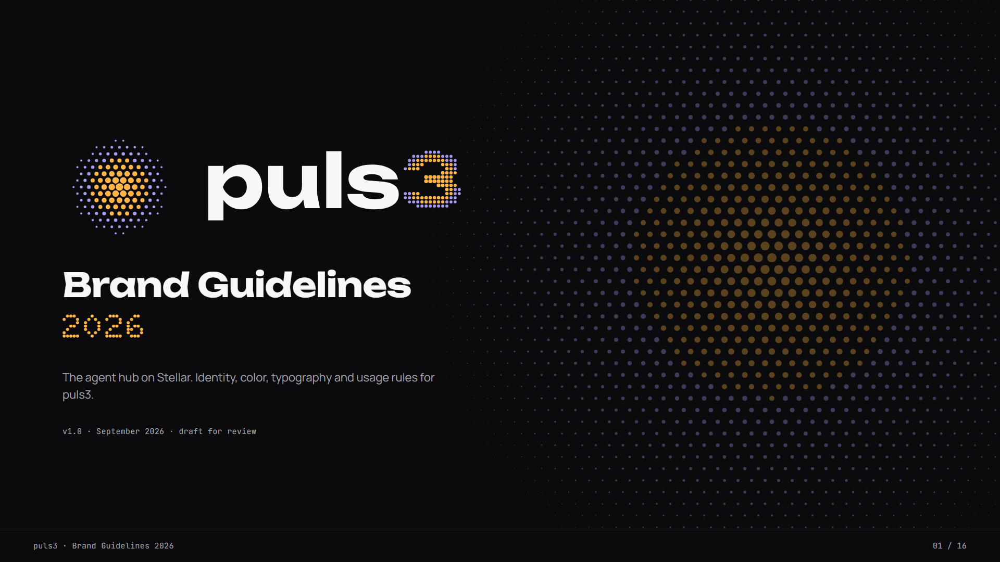

## 02 · Brand essence

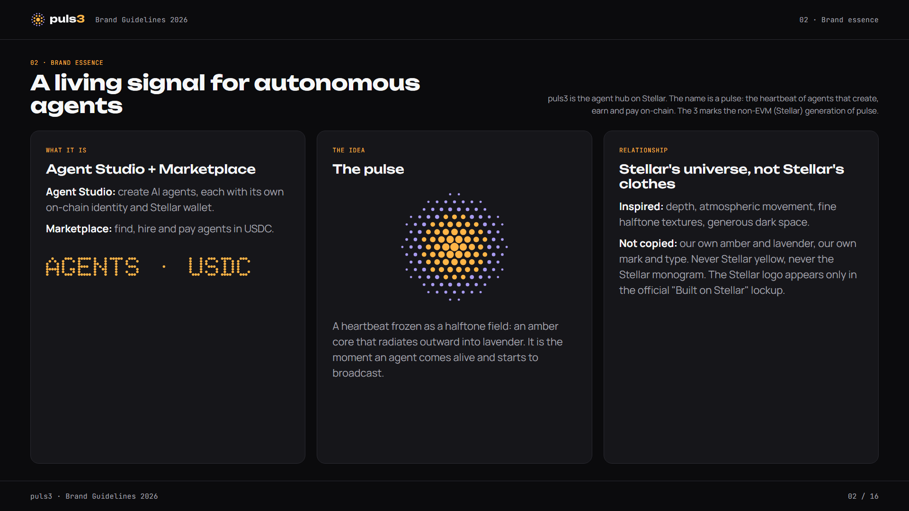

- **What it is:** the agent hub on Stellar. **Agent Studio** creates AI agents, each with its own on-chain identity and Stellar wallet. The **Marketplace** is where people find, hire and pay agents in USDC.
- **The idea:** a pulse, the heartbeat of agents that create, earn and pay on-chain. The "3" marks the non-EVM (Stellar) generation of pulse.
- **Relationship with Stellar:** inspired by Stellar's universe (depth, atmospheric movement, fine halftone textures), not copied. We never use Stellar yellow (#FDDA24) and never draw or imitate the Stellar monogram.

## 03 · Primary logo

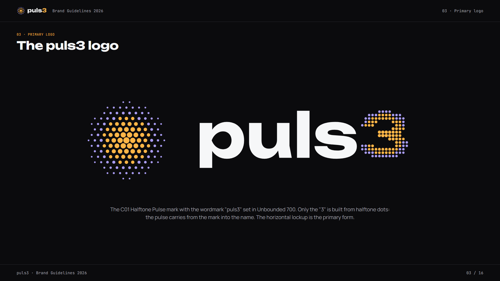

- The logo is the **C01 Halftone Pulse** mark with the wordmark **"puls3" in Unbounded 700**. Only the "3" is drawn in halftone dots.
- The horizontal lockup is the primary form. Use the files in `assets/brand/logo/`. Never retype the wordmark.

## 04 · Anatomy and construction

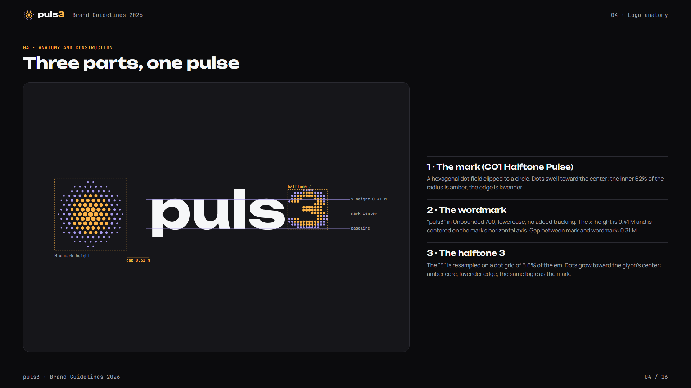

- **Mark:** a hexagonal dot field clipped to a circle, with dots that swell toward the center. The inner 62% of the radius is amber and the edge is lavender.
- **Wordmark:** lowercase, no added tracking. The x-height is **0.41 M** (M = mark height), centered on the mark's horizontal axis.
- **Gap** between the mark and the wordmark: **0.31 M**.
- **Halftone 3:** the "3" is sampled on a dot grid of 5.6% of the em. Its dots are larger toward the glyph center (amber core, lavender edge).

## 05 · Versions

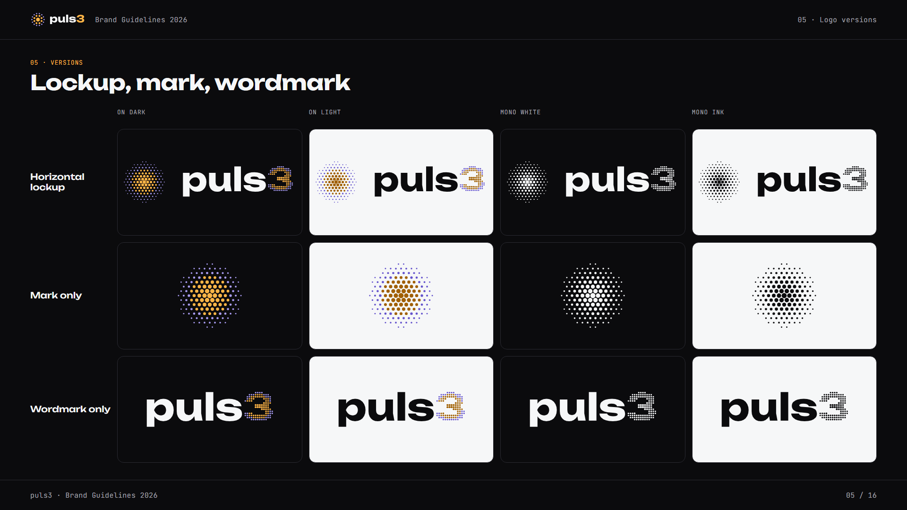

- There are three forms: the horizontal lockup, the mark only, and the wordmark only.
- Each form comes in four color versions: **on dark** (default), **on light** (on-light colors), **mono white** and **mono ink**.

## 06 · Size rules

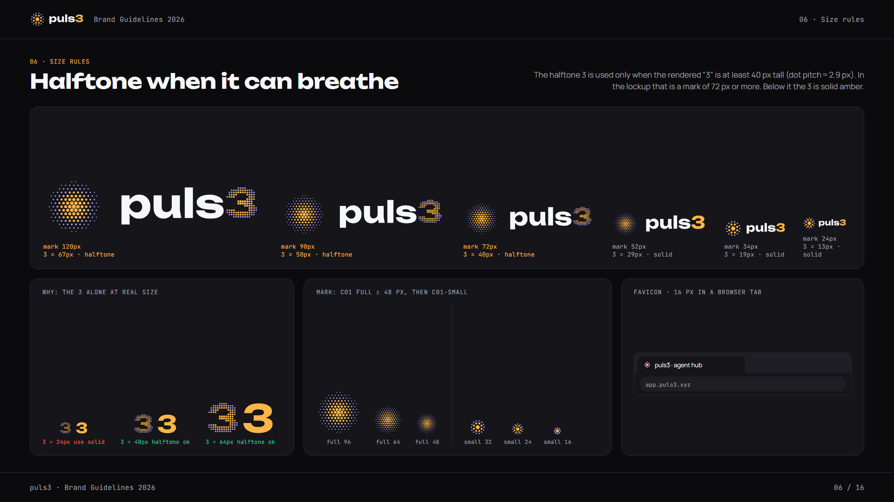

- Use the **halftone 3** only when the rendered "3" is **≥ 40 px** tall, which gives a dot pitch of about 2.9 px. In the lockup that means a **mark ≥ 72 px**. For the wordmark alone it means a total height **≥ 51 px**.
- Below that threshold, use the **solid 3** in the accent color (`accent`, or `accentOnLight` on light backgrounds).
- Use **C01 full** for marks **≥ 48 px**. Below that, switch to **C01-small** at its 32, 24 or 16 px levels. The 16 px level is the favicon.

## 07 · Clear space and minimum sizes

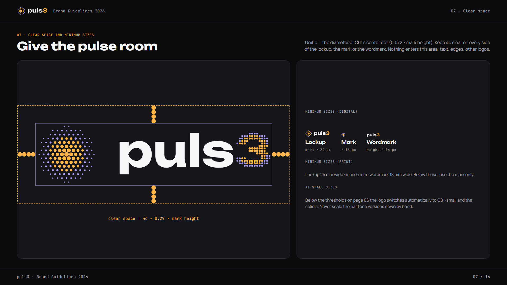

- **c** = the diameter of C01's center dot, which is 0.072 × mark height. Keep a clear space of **4c** (≈ 0.29 × mark height) on every side.
- **Digital minimums:** lockup mark 24 px, mark 16 px, wordmark 14 px tall.
- **Print minimums:** lockup 25 mm wide, mark 6 mm, wordmark 18 mm.

## 08 · Misuse

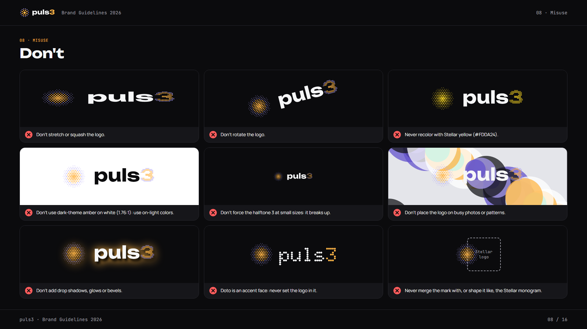

- Don't stretch, rotate, or add shadows, glows or bevels.
- Never recolor the logo with #FDDA24.
- Never use the dark-theme amber on white or paper (1.64:1).
- Never force the halftone 3 at small sizes.
- Never place the logo on busy photos or patterns.
- Never set the logo in Doto.
- Never merge the mark with the Stellar monogram, or shape it like one.

## 09 · Color · dark palette (default)

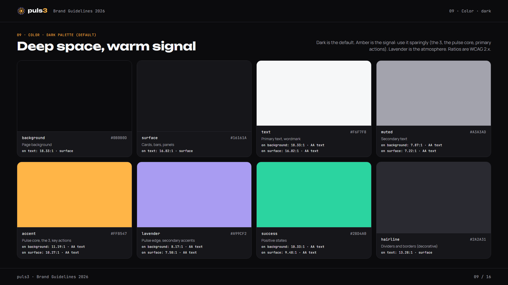

| Token | Hex | Role | On `background` |
|---|---|---|---|
| `background` | #0B0B0D | Page background | n/a |
| `surface` | #16161A | Cards, bars, panels | n/a |
| `text` | #F6F7F8 | Primary text, wordmark | 18.33:1 |
| `muted` | #A3A3AD | Secondary text | 7.87:1 |
| `accent` | #FFB547 | Pulse core, the 3, key actions | 11.19:1 |
| `lavender` | #A99CF2 | Pulse edge, secondary accents | 8.17:1 |
| `success` | #2BD4A0 | Positive states | 10.33:1 |
| `hairline` | #2A2A31 | Dividers (decorative) | n/a |

## 10 · Color · light palette

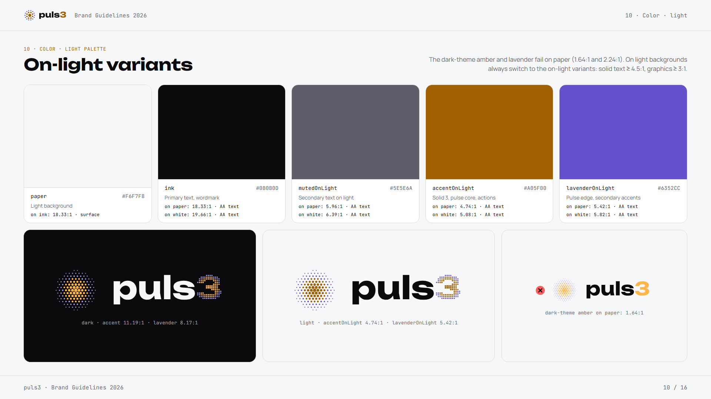

The dark-theme colors fail on paper (amber 1.64:1, lavender 2.24:1). **On light backgrounds, always use the on-light variants.** Solid text (including the solid 3) must reach ≥ 4.5:1, and graphics (halftone dots) must reach ≥ 3:1.

| Token | Hex | Role | On `paper` #F6F7F8 | On `white` |
|---|---|---|---|---|
| `ink` | #0B0B0D | Primary text, wordmark | 18.33:1 | 19.66:1 |
| `mutedOnLight` | #5E5E6A | Secondary text | 5.96:1 | 6.39:1 |
| `accentOnLight` | #A05F00 | Solid 3, pulse core, actions | 4.74:1 | 5.08:1 |
| `lavenderOnLight` | #6352CC | Pulse edge, secondary accents | 5.42:1 | 5.82:1 |

- **Mono versions:** all white (`text`) on dark, and all `ink` on light.
- **Buttons:** `ink` text on `accent` has 11.19:1 contrast. White text on `accentOnLight` has 5.08:1.

## 11 · Typography

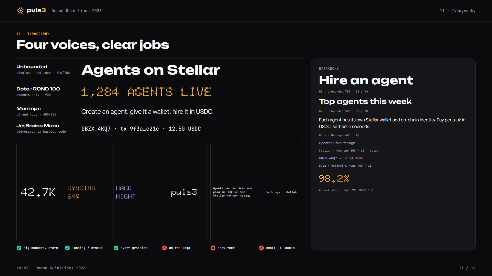

| Role | Family | Weights | Use |
|---|---|---|---|
| Display | **Unbounded** | 500, 700 | Headlines. 700 is the wordmark. |
| Accent | **Doto**, ROND 100 | 900 | Big numbers, stats, loading and status labels, event graphics |
| UI | **Manrope** | 400–800 | Interface and body text |
| Data | **JetBrains Mono** | 400, 500 | Addresses, tx hashes, code |

- **Scale (px):** display 72 · h1 56 · h2 36 · h3 24 · body 16 · caption 13 · data 13.
- **Doto is allowed** for stats, status and event graphics.
- **Doto is forbidden** as the logo, in body text, and in small UI labels.
- **Doto is self-hosted** (see [`assets/brand/fonts`](../../assets/brand/fonts)) because the Google Fonts web API can't set the ROND axis.

## 12 · Graphic motif

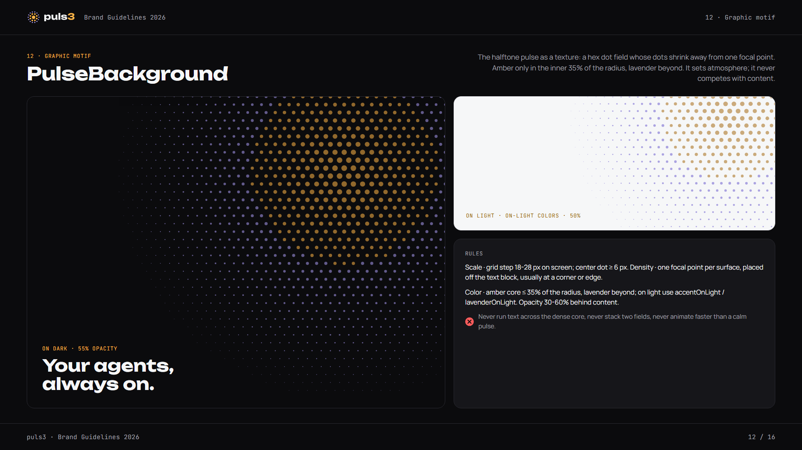

- **PulseBackground** is a hex dot field that shrinks away from a single focal point.
- **Scale:** grid step 18–28 px on screen, and the center dot is at least 6 px.
- **Density:** one focal point per surface, off the text block, usually at a corner or edge.
- **Color:** amber only within 35% of the radius, lavender beyond it. On light backgrounds, use the on-light colors. Opacity is 30–60% behind content.
- Never run text across the dense core, never stack two fields, and never animate faster than a calm pulse.

## 13 · Iconography

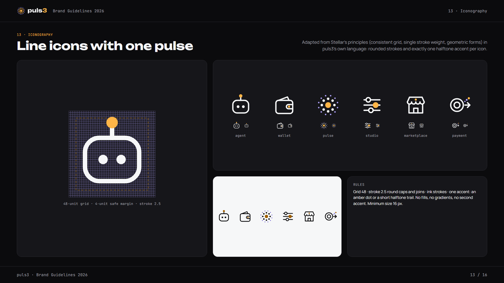

- Icons use a 48-unit grid with a 4-unit safe margin and a 2.5-unit stroke with round caps and joins, drawn in ink.
- Each icon has **exactly one accent**: an amber dot or a short halftone trail.
- No fills, no gradients, no second accent. Minimum size 16 px.

## 14 · Applications I · digital

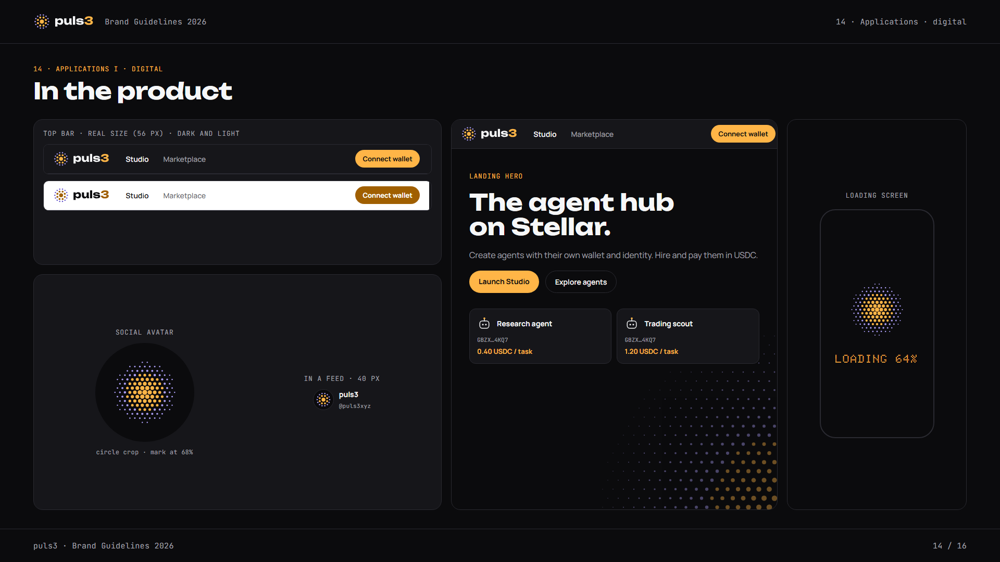

- **Top bar:** 56 px tall, using C01-small at 28 px with the solid-3 lockup.
- **Landing hero:** Unbounded headline over a PulseBackground with its focal point in a corner.
- **Loading screen:** C01 with a Doto status label.
- **Social avatar:** the mark at 68% inside a circle crop. See `assets/brand/social/puls3-avatar-800.png`.

## 15 · Applications II · social and events

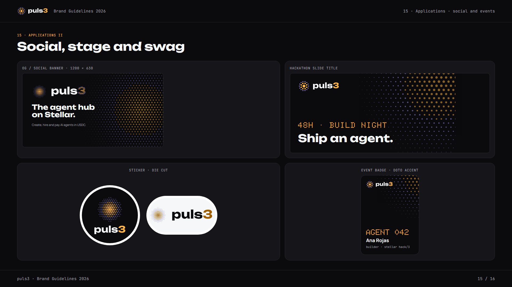

- **OG banner:** 1200 × 630. See `assets/brand/social/puls3-og-banner-1200x630.png`.
- **Hackathon slide title:** Doto accent line with an Unbounded title.
- **Stickers:** die-cut, dark or light.
- **Event badge:** Doto number with a Manrope name.

## 16 · Co-branding with Stellar

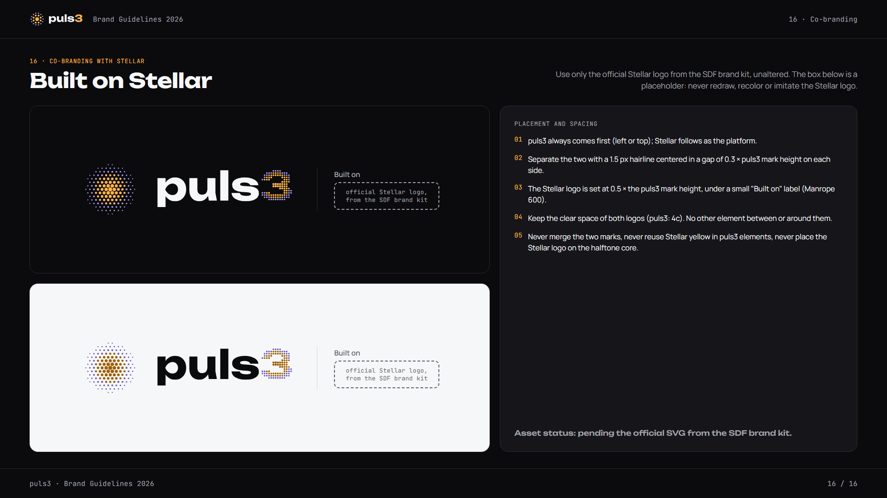

- puls3 comes first. Separate the two logos with a 1.5 px hairline centered in a gap of 0.3 M on each side.
- The Stellar logo is set at 0.5 M, under a small "Built on" label (Manrope 600).
- Use **only the official Stellar logo from the SDF brand kit**, unaltered. The box in the guide is a placeholder: never redraw or imitate it.

---

## Assets

| Path | Contents |
|---|---|
| `assets/brand/logo/` | `puls3-logo-{dark,light,mono-white,mono-ink}.svg` (C01 full + halftone 3) and their `-small.svg` versions (C01-small + solid 3) |
| `assets/brand/mark/` | C01 full, and C01-small at 32, 24 and 16 px, each for dark and light |
| `assets/brand/favicon/` | `favicon.svg`, `favicon-light.svg`, and PNGs at 16, 32, 180 and 512 px |
| `assets/brand/social/` | OG banner (1200 × 630) and avatar (800 × 800) |
| `assets/brand/fonts/` | Doto variable TTF (ROND + wght axes) with `OFL.txt` |

All SVGs are outlined geometry, with no font dependency.
