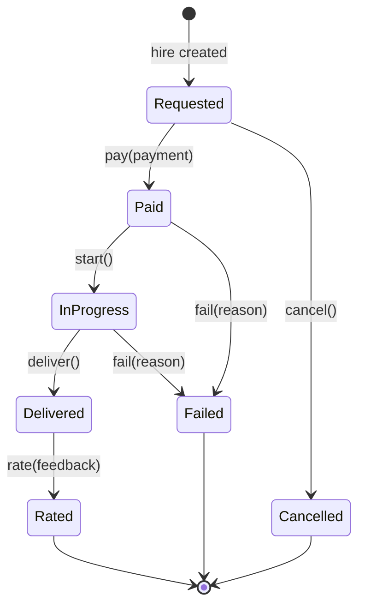

# Hire lifecycle

- **Issue:** #10 · **Code:** `Hire` in [`puls3_domain/lib/src/entities.dart`](../../puls3_domain/lib/src/entities.dart) · **Model:** [domain model](model.md)

A hire is one task a consumer asks an agent to do. This page defines, once, which states a hire goes through and what moves it between them, so the app, the server and the agent runtime cannot disagree (for example, an agent working on a task nobody paid for).

Every transition is a method on `Hire` that returns a **new** `Hire` and leaves the original unchanged, or throws a typed `DomainError`. There is no I/O: the server decides *when* to call a transition (after reading the chain, after the runtime reports back); the domain decides whether it is allowed.

## States

| State | Meaning | Terminal |
|---|---|---|
| `requested` | The consumer asked for the task; nothing is paid yet | No |
| `paid` | A payment that settles this hire was verified on-chain. The hire keeps its transaction hash | No |
| `inProgress` | The agent is working on the task | No |
| `delivered` | The agent returned a result | No |
| `rated` | The consumer rated the hire | **Yes** |
| `cancelled` | The hire was dropped before it was paid | **Yes** |
| `failed` | The task could not be completed after payment. Refunds are out of the MVP ([vision](../vision.md#out), [ADR-0003](../adr/0003-payment-rail-and-custody.md)) | **Yes** |

## Transitions

| From | Event (method) | To | Guard | Triggered by |
|---|---|---|---|---|
| `requested` | `pay(payment, agentWallet:)` | `paid` | `payment.settles(hire, agentWallet:)`: the payment is for this hire, went to the agent's wallet, and its amount equals the hire price exactly (ADR-0003); otherwise `PaymentDoesNotSettleHire`. And `payment.payer` is the hire's consumer; otherwise `PaymentNotFromConsumer` | Server, after verifying the transaction on the chain |
| `requested` | `cancel()` | `cancelled` | — | Consumer (app) or server |
| `paid` | `start()` | `inProgress` | — | Server (agent runtime, #20) |
| `paid` | `fail(reason:)` | `failed` | `reason` is not blank | Server (the runtime could not start the task) |
| `inProgress` | `deliver()` | `delivered` | — | Agent, reported by the runtime |
| `inProgress` | `fail(reason:)` | `failed` | `reason` is not blank | Agent or server (error or timeout) |
| `delivered` | `rate(feedback)` | `rated` | The feedback is for this hire, this agent, and was left by this hire's consumer. Otherwise `FeedbackDoesNotMatchHire` | Consumer (app) |

Any other event in any state throws `InvalidHireTransition(from, event)`. That includes every event in the three terminal states.

## Rules this guarantees

- **A new hire always starts in `requested`.** The public constructor cannot create a hire in any other state.
- **The consumer is one address throughout:** the one who hires is the one who pays (`pay` checks it) and the one who rates (`rate` checks it). It is the `client_address` the Reputation Registry authorizes (ADR-0002).
- **`paid` is reachable only through `pay`**, which requires a `Payment`. So every hire in `paid`, `inProgress`, `delivered`, `rated` and, when it failed after payment, `failed`, carries the payment's `TransactionHash`.
- **Money never moves backwards in the domain:** there is no transition out of `paid` to `cancelled`. A paid task ends in `delivered`/`rated` or in `failed`.
- **Terminal states are final:** `rated`, `cancelled` and `failed` accept no event.

## Open questions

1. **Timeouts:** who calls `fail` when an agent never answers, and after how long. Timeouts and automatic cancellation are out of scope for #10; the agent runtime (#20) decides them.
2. **Unpaid hires that are never paid:** whether the server cancels `requested` hires after some time, and when.
3. **Refunds on `failed`:** out of the MVP. If they are added, `failed` gains a transition such as `refund`.
