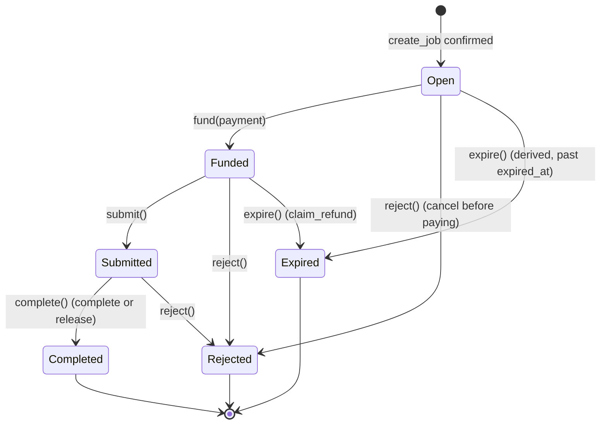

# Hire lifecycle

- **Issues:** #10, #73 · **Decision:** [ADR-0005](../adr/0005-align-agent-commerce-with-erc-8183-and-erc-8004.md) D6 · **Code:** `Hire` in [`puls3_domain/lib/src/entities.dart`](../../puls3_domain/lib/src/entities.dart) · **Model:** [domain model](model.md)

A hire is one task a consumer asks an agent to do. It is an ERC-8183 job in the puls3 escrow: the consumer is the client and the evaluator, and the agent wallet is the provider. This page defines, once, which states a hire goes through and what moves it between them, so the app, the server and the agent runtime cannot disagree (for example, an agent working on a task nobody funded).

**The lifecycle mirrors the escrow job 1:1.** Every hire state is an ERC-8183 job state with the same name, so the server can derive a hire's state from the job. Off-chain facts (runtime progress, the state a hire was rejected from, feedback) are data on the hire, not states.

Every transition is a method on `Hire` that returns a **new** `Hire` and leaves the original unchanged, or throws a typed `DomainError`. There is no I/O: the server applies a transition once the matching escrow transaction is final (the tracker, [API contract](../architecture/api.md)); the domain decides whether it is allowed. Time rules (`expired_at`, the approval window) are enforced by the escrow, not by the domain.

## States

| State | ERC-8183 | Meaning | Terminal |
|---|---|---|---|
| `open` | `Open` | The job was created and priced; it is not funded yet | No |
| `funded` | `Funded` | The escrow holds the funds. The hire keeps the `fund` transaction hash and stays `funded` while the agent works | No |
| `submitted` | `Submitted` | The agent delivered; the client evaluates it (ADR-0005 D4) | No |
| `completed` | `Completed` | The client accepted, or the approval window passed; the escrow paid the agent | **Yes** |
| `rejected` | `Rejected` | Rejected from `open` (a cancel before paying), `funded` or `submitted`; any funds went back to the client | **Yes** |
| `expired` | `Expired` | Past `expired_at`: refunded through `claim_refund`, or an unfunded job with nothing to refund | **Yes** |

A hire exists in the domain once `create_job` is confirmed. Before that, the server holds a pending preparation with no status; abandoning it needs no transition (ADR-0005 D6, "No job, no state").

## Transitions

| From | Event (method) | To | Escrow call | Guard | Triggered by |
|---|---|---|---|---|---|
| `open` | `fund(payment, agentWallet:)` | `funded` | `fund` | `payment.settles(hire, agentWallet:)`: the payment is for this hire, its payee is the agent's wallet (the job's provider), and its amount equals the hire price exactly; otherwise `PaymentDoesNotSettleHire`. And `payment.payer` is the hire's consumer; otherwise `PaymentNotFromConsumer`. Sets `runtimeStatus` to `queued` | Tracker, after funding verification |
| `open` | `reject()` | `rejected` | `reject` by the client | — | Tracker, after the client's reject is final |
| `open` | `expire()` | `expired` | none (derived: `is_expired`) | — | Server, when an unfunded job passes `expired_at` |
| `funded` | `submit()` | `submitted` | `submit` by the provider | — | Tracker, after the runtime's `submit` is final |
| `funded` | `reject()` | `rejected` | `reject` by the evaluator | — | Tracker (for example, a reject and refund after a failed run) |
| `funded` | `expire()` | `expired` | `claim_refund` | — | Tracker, after `claim_refund` is final |
| `submitted` | `complete()` | `completed` | `complete` by the evaluator, or permissionless `release` after the approval window | — | Tracker |
| `submitted` | `reject()` | `rejected` | `reject` by the evaluator, before the approval deadline | — | Tracker |

`reject()` records the state it came from in `rejectedFrom`. The app labels a reject from `open` as "Cancelled", and only rejects from `submitted` count against the client (ADR-0005 D8).

A `submitted` hire cannot expire: the escrow releases it to the agent before `expired_at` and refuses `claim_refund` on `Submitted` jobs (ADR-0005 D4, a puls3 restriction of ERC-8183).

Any other event in any state throws `InvalidHireTransition(from, event)`. That includes every event in the three terminal states.

## Hire data outside the lifecycle

| Data | Values | Set by | Rule |
|---|---|---|---|
| `runtimeStatus` | `queued`, `running`, `failed` (`RuntimeStatus`) | `fund` sets `queued`; `startRun()` sets `running`; `failRun(reason:)` sets `failed` and `failureReason` | Changes only while the hire is `funded`: `queued` → `running`, and `queued` or `running` → `failed` with a non-blank reason. Otherwise `InvalidRuntimeTransition` (or `InvalidHire` for a blank reason). The hire stays `funded`; a failed run ends in `rejected` (the client's reject and refund) or `expired` (`claim_refund`) |
| `rejectedFrom` | `open`, `funded`, `submitted` | `reject()` | Set once, when the hire is rejected |
| `feedbackReference` | the `give_feedback` transaction hash | `recordFeedback(feedback, reference:)` | Only on a `completed` hire (`HireNotCompleted`), at most once (`HireAlreadyRated`), and only for feedback for this hire and agent, left by its consumer (`FeedbackDoesNotMatchHire`). The status does not change |

## Rules this guarantees

- **A new hire always starts in `open`.** The public constructor cannot create a hire in any other state.
- **The consumer is one address throughout:** the one who hires is the one who funds (`fund` checks it) and the one who rates (`recordFeedback` checks it). It is the job's client and evaluator.
- **`funded` is reachable only through `fund`**, which requires a `Payment`. So every hire that was funded carries the `fund` transaction hash in every later state.
- **Every state has an on-chain equivalent.** The only derived case is an `open` job past `expired_at`, reported as `expired` with no transaction (ADR-0005 D6).
- **Terminal states are final:** `completed`, `rejected` and `expired` accept no event.

## Open questions

1. **Timeout values** (job `expired_at`, unfunded window, runtime timeout, approval window) are deferred (ADR-0005 D3). They must satisfy runtime timeout + approval window < `expired_at`.
