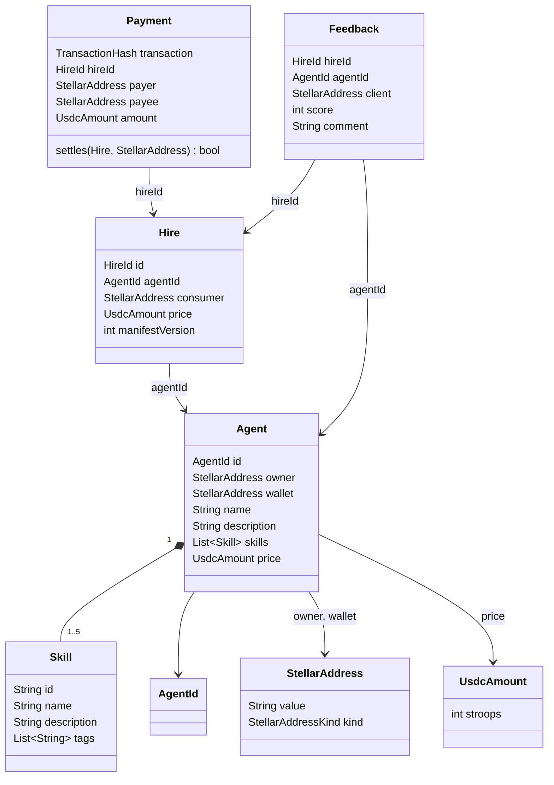

# Domain model

- **Issue:** #9 · **Package:** [`puls3_domain/`](../../puls3_domain/) (pure Dart, [ADR-0001](../adr/0001-system-architecture.md))

The domain is the ubiquitous language of puls3. The backend, the app and the contracts use these names. It has no dependency on Serverpod, Flutter or any Stellar SDK; it talks to the outside world only through the ports below.

## Glossary

| Term | Definition |
|---|---|
| **Agent** | An AI agent published in puls3: it has an on-chain identity (`AgentId`), an owner, a wallet that receives its payments, skills, and a price per task. |
| **Owner** | The Stellar address that registered the agent on-chain and controls it. It is the field `Agent.owner`, not a class. |
| **Skill** | One thing an agent is good at, such as "Release notes". An agent lists between one and five. |
| **Hire** | One task a consumer asks an agent to do, at the price the agent had when the hire was created. Its lifecycle (requested, paid, delivered…) is #10. |
| **Payment** | The USDC transfer on Stellar that pays for a hire: who paid, who received, how much, and in which transaction. |
| **Feedback** | The score (1 to 5) and optional comment a consumer leaves about a hire they paid for. |
| **Reputation** | What the catalog shows about an agent's past work, computed from its feedback. The formula is #11; it is not a class here. |

Value objects: `StellarAddress` (a `G…` account or `C…` contract address), `UsdcAmount` (USDC in stroops, an integer), `AgentId` (the on-chain agent id), `HireId`, `TransactionHash`.

## Class diagram

## Ports

Interfaces the domain defines and the backend implements (ADR-0001):

| Port | What it does | Implemented by |
|---|---|---|
| `AgentRepository` | Load and store agents | Serverpod ORM (#16, #17) |
| `LedgerPort` | Read the chain: find the payment a transaction made, and an agent's wallet | Stellar RPC adapter ([ADR-0003](../adr/0003-payment-rail-and-custody.md)) |
| `AgentRuntimePort` | Run an agent's task and return its output | Agent runtime (#20) |

## Invariants

Each invariant has at least one test named after it (`I1`, `I2`, …) that fails if the rule is broken. Breaking one throws a typed `DomainError` subclass, never a plain string.

| # | Invariant | Error |
|---|---|---|
| I1 | A `StellarAddress` is 56 characters of base32, starts with `G` (account) or `C` (contract), and its version byte and CRC16 checksum are valid | `InvalidStellarAddress` |
| I2 | A `UsdcAmount` is an integer number of stroops (7 decimals), never negative, and at most 2⁵³−1 so it is exact on the web too. Money is never a `double` | `InvalidAmount` |
| I3 | An `AgentId` is between 0 and 4,294,967,295 (the contract's `u32`, ADR-0002) | `InvalidAgentId` |
| I4 | A `HireId` is between 1 and 2⁵³−1 (it travels as the payment's muxed id, ADR-0003) | `InvalidHireId` |
| I5 | A `TransactionHash` is 64 lowercase hexadecimal characters | `InvalidTransactionHash` |
| I6 | A `Skill` id is kebab-case, and its name is 1 to 48 characters | `InvalidSkill` |
| I7 | An `Agent` name is 3 to 48 characters | `InvalidAgent` |
| I8 | An `Agent` description is 10 to 280 characters | `InvalidAgent` |
| I9 | An `Agent` has between 1 and 5 skills | `InvalidAgent` |
| I10 | The skill ids of an `Agent` are unique | `InvalidAgent` |
| I11 | An `Agent` price is greater than zero | `InvalidAgent` |
| I12 | A `Hire` price is greater than zero | `InvalidHire` |
| I13 | A `Hire` manifest version is at least 1 (ADR-0004) | `InvalidHire` |
| I14 | A `Payment` amount is greater than zero | `InvalidPayment` |
| I15 | A `Payment` settles a `Hire` only if it is for that hire, it was paid to the agent's wallet, and the amount equals the hire price exactly (ADR-0003) | — (returns `false`) |
| I16 | A `Feedback` score is an integer from 1 to 5 | `InvalidFeedback` |
| I17 | A `Feedback` comment is at most 500 characters | `InvalidFeedback` |
