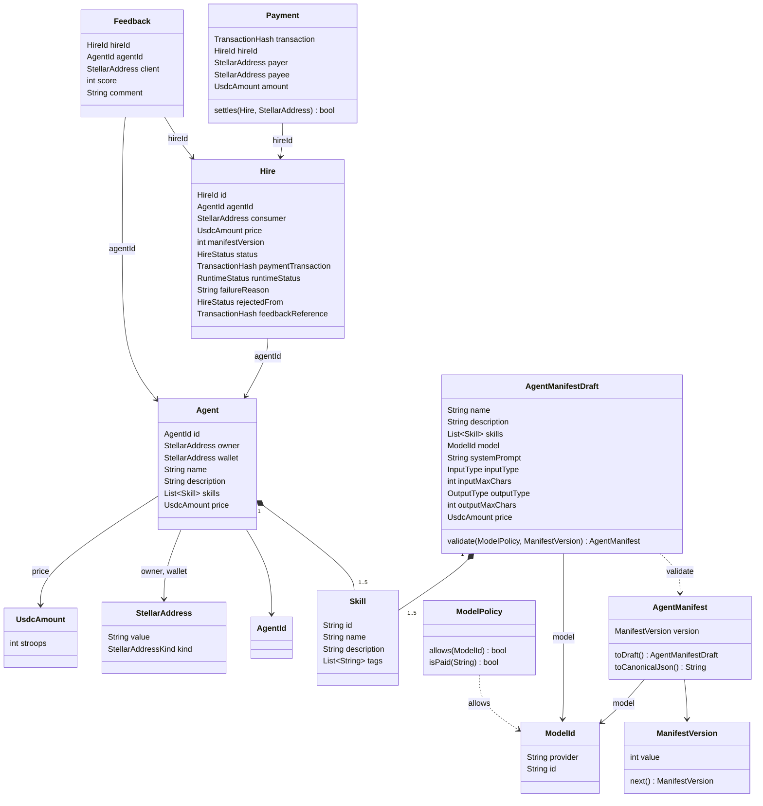

# Domain model

- **Issue:** #9 · **Package:** [`puls3_domain/`](../../puls3_domain/) (pure Dart, [ADR-0001](../adr/0001-system-architecture.md))

The domain is the ubiquitous language of puls3. The backend, the app and the contracts use these names. It has no dependency on Serverpod, Flutter or any Stellar SDK; it talks to the outside world only through the ports below.

## Glossary

| Term | Definition |
|---|---|
| **Agent** | An AI agent published in puls3: it has an on-chain identity (`AgentId`), an owner, a wallet that receives its payments, skills, and a price per task. |
| **Owner** | The Stellar address that registered the agent on-chain and controls it. It is the field `Agent.owner`, not a class. |
| **Skill** | One thing an agent is good at, such as "Release notes". An agent lists between one and five. |
| **Hire** | One task a consumer asks an agent to do, at the price the agent had when the hire was created. It is an ERC-8183 escrow job and moves through the same states: `open`, `funded`, `submitted`, then `completed`, `rejected` or `expired` ([ADR-0005](../adr/0005-align-agent-commerce-with-erc-8183-and-erc-8004.md) D6); see [Hire lifecycle](hire-lifecycle.md). Runtime progress and feedback are data on the hire, not states. |
| **Payment** | The USDC transfer on Stellar that pays for a hire: who paid, who received, how much, and in which transaction. |
| **Feedback** | The score (1 to 5) and optional comment a consumer leaves about a hire they paid for. The hire keeps a reference to it once it is confirmed on-chain. |
| **Manifest** | The deployable definition of an agent ([ADR-0004](../adr/0004-agent-manifest-and-deployment.md)): name, description, skills, model, system prompt, input and output limits, price, and a version. It is immutable, and editing creates a new version. `AgentManifest` in code. |
| **Draft** | A manifest still being edited: every field optional, no version. `validate` is the deploy gate. `AgentManifestDraft` in code. |
| **ModelId** | The model an agent runs on: a provider (`workers-ai` for the free Cloudflare Workers AI, or a paid provider the builder brings their own key for) and a provider-specific id. It never holds a credential. |
| **ModelPolicy** | The configured list of models agents may use. It is injected into validation and is not a domain constant. |
| **ManifestVersion** | The version number of a deployed manifest, from 1 to 2⁵³−1. A hire records the version it was paid for (`Hire.manifestVersion`). |
| **Reputation** | What the catalog shows about an agent's past work, computed from its feedback. The formula is #11; it is not a class here. |

Value objects: `StellarAddress` (a `G…` account or `C…` contract address), `UsdcAmount` (USDC in stroops, an integer), `AgentId` (the on-chain agent id), `HireId`, `TransactionHash`.

## Class diagram

```mermaid
classDiagram
  class Agent {
    AgentId id
    StellarAddress owner
    StellarAddress wallet
    String name
    String description
    List~Skill~ skills
    UsdcAmount price
  }
  class Skill {
    String id
    String name
    String description
    List~String~ tags
  }
  class Hire {
    HireId id
    AgentId agentId
    StellarAddress consumer
    UsdcAmount price
    int manifestVersion
    HireStatus status
    TransactionHash paymentTransaction
    RuntimeStatus runtimeStatus
    String failureReason
    HireStatus rejectedFrom
    TransactionHash feedbackReference
  }
  class Payment {
    TransactionHash transaction
    HireId hireId
    StellarAddress payer
    StellarAddress payee
    UsdcAmount amount
    settles(Hire, StellarAddress) bool
  }
  class Feedback {
    HireId hireId
    AgentId agentId
    StellarAddress client
    int score
    String comment
  }
  class StellarAddress {
    String value
    StellarAddressKind kind
  }
  class UsdcAmount {
    int stroops
  }
  class AgentManifestDraft {
    String name
    String description
    List~Skill~ skills
    ModelId model
    String systemPrompt
    InputType inputType
    int inputMaxChars
    OutputType outputType
    int outputMaxChars
    UsdcAmount price
    validate(ModelPolicy, ManifestVersion) AgentManifest
  }
  class AgentManifest {
    ManifestVersion version
    toDraft() AgentManifestDraft
    toCanonicalJson() String
  }
  class ModelId {
    String provider
    String id
  }
  class ModelPolicy {
    allows(ModelId) bool
    isPaid(String) bool
  }
  class ManifestVersion {
    int value
    next() ManifestVersion
  }
  Agent "1" *-- "1..5" Skill
  AgentManifestDraft ..> AgentManifest : validate
  AgentManifestDraft --> ModelId : model
  AgentManifestDraft "1" *-- "1..5" Skill
  AgentManifest --> ManifestVersion
  AgentManifest --> ModelId : model
  ModelPolicy ..> ModelId : allows
  Agent --> AgentId
  Agent --> StellarAddress : owner, wallet
  Agent --> UsdcAmount : price
  Hire --> Agent : agentId
  Payment --> Hire : hireId
  Feedback --> Hire : hireId
  Feedback --> Agent : agentId
```

## Ports

Interfaces the domain defines and the backend implements (ADR-0001):

| Port | What it does | Implemented by |
|---|---|---|
| `AgentRepository` | Load and store agents | Serverpod ORM (#16, #17) |
| `LedgerPort` | Read the chain: find the payment a transaction made, and an agent's wallet | Stellar RPC adapter ([ADR-0003](../adr/0003-payment-rail-and-custody.md)) |
| `AgentRuntimePort` | Run an agent's task and return its output | Agent runtime (#20) |

## Invariants

Each invariant has at least one test named after it (`I1`, `I2`, …) that fails if the rule is broken. Breaking one throws a typed `DomainError` subclass, never a plain string.

| # | Invariant | Error |
|---|---|---|
| I1 | A `StellarAddress` is 56 characters of base32, starts with `G` (account) or `C` (contract), and its version byte and CRC16 checksum are valid | `InvalidStellarAddress` |
| I2 | A `UsdcAmount` is an integer number of stroops (7 decimals), never negative, and at most 2⁵³−1 so it is exact on the web too. Money is never a `double` | `InvalidAmount` |
| I3 | An `AgentId` is between 0 and 4,294,967,295 (the contract's `u32`, ADR-0002) | `InvalidAgentId` |
| I4 | A `HireId` is between 1 and 2⁵³−1 (it travels as the payment's muxed id, ADR-0003) | `InvalidHireId` |
| I5 | A `TransactionHash` is 64 lowercase hexadecimal characters | `InvalidTransactionHash` |
| I6 | A `Skill` id is kebab-case, and its name is 1 to 48 characters | `InvalidSkill` |
| I7 | An `Agent` name is 3 to 48 characters | `InvalidAgent` |
| I8 | An `Agent` description is 10 to 280 characters | `InvalidAgent` |
| I9 | An `Agent` has between 1 and 5 skills | `InvalidAgent` |
| I10 | The skill ids of an `Agent` are unique | `InvalidAgent` |
| I11 | An `Agent` price is greater than zero | `InvalidAgent` |
| I12 | A `Hire` price is greater than zero | `InvalidHire` |
| I13 | A `Hire` manifest version is at least 1 (ADR-0004) | `InvalidHire` |
| I14 | A `Payment` amount is greater than zero | `InvalidPayment` |
| I15 | A `Payment` settles a `Hire` only if it is for that hire, it was paid to the agent's wallet, and the amount equals the hire price exactly (ADR-0003) | — (returns `false`) |
| I16 | A `Feedback` score is an integer from 1 to 5 | `InvalidFeedback` |
| I17 | A `Feedback` comment is at most 500 characters | `InvalidFeedback` |
| I18 | A `Hire` changes state only through the transitions of [Hire lifecycle](hire-lifecycle.md), which mirror ERC-8183; any other event is rejected, and terminal states (`completed`, `rejected`, `expired`) accept none | `InvalidHireTransition` |
| I19 | A `Hire` reaches `funded` only with a `Payment` that settles it (I15) and was made by the hire's consumer, and keeps that payment's transaction hash from then on | `PaymentDoesNotSettleHire`, `PaymentNotFromConsumer` |
| I20 | A `Hire` records feedback only when it is `completed`, at most once, and only for that hire and agent, left by its consumer. Its status does not change | `HireNotCompleted`, `HireAlreadyRated`, `FeedbackDoesNotMatchHire` |
| I21 | Runtime progress moves only while the hire is `funded`: `queued` (set by `fund`) → `running`, and `queued` or `running` → `failed` with a non-blank reason | `InvalidRuntimeTransition`, `InvalidHire` |
| I22 | A `rejected` hire records the state it was rejected from (`open`, `funded` or `submitted`) | — |
| I23 | A `ModelId` has a kebab-case provider of at most 32 characters and an id that is not blank, has no whitespace and is at most 128 characters (runes). It holds no credential | `InvalidManifest` (`modelMalformed`) |
| I24 | A `ModelPolicy` never lists `workers-ai` as a paid provider. `workers-ai` passes only for the ids in `workersAiModels`; a paid provider passes when it is in `paidProviders`, with any id; `isPaid` is true for every provider except `workers-ai` | `ArgumentError` (policy), `InvalidManifest` (`modelNotAllowed`, `modelProviderNotEnabled`) |
| I25 | A `ManifestVersion` is an integer from 1 to 2⁵³−1; `next()` past the maximum fails. Drafts have no version | `InvalidManifest` (`versionInvalid`) |
| I26 | An `AgentManifestDraft` may have any field missing or a text below its minimum, but never above a maximum, a `max_chars` below 1, with duplicate skill ids, with `tools`, unknown keys or a `version` | `InvalidManifest` |
| I27 | Manifest texts count runes, a blank text counts as missing, and stored text is never trimmed. Name 3 to 48, description 10 to 280, system prompt 20 to 8,000 | `InvalidManifest` (`nameTooShort`, …) |
| I28 | A manifest has 1 to 5 skills with unique ids, each a valid `Skill` (I6) | `InvalidManifest` (`skillsMissing`, `skillsTooMany`, `skillIdDuplicate`, …) |
| I29 | A deployable manifest's model passes the injected `ModelPolicy` (I24) | `InvalidManifest` (`modelNotAllowed`, `modelProviderNotEnabled`) |
| I30 | `input.max_chars` is 1 to 8,000 and `output.max_chars` is 1 to 16,000 (a value below 1 is rejected in drafts too); input type is `text`, output type is `text` or `markdown` | `InvalidManifest` (`inputMaxCharsTooLow`, `outputMaxCharsTooHigh`, …) |
| I31 | A manifest price is a positive `UsdcAmount` in `USDC` | `InvalidManifest` (`priceNotPositive`, `priceAssetUnsupported`) |
| I32 | `validate` turns a complete draft into an immutable `AgentManifest` or throws one `InvalidManifest` listing every broken rule once, in field order (then skill order). The same input gives the same result | `InvalidManifest` |

The manifest invariants (I23–I32) are tested in `puls3_domain/test/manifest_test.dart`. Its other groups cover the wire form: `fromJson` reports every type mismatch as a problem and never throws a type error; integral numbers count as integers (on the web `3.0` and `3` are one value); `toCanonicalJson()` sorts keys at every depth, writes no whitespace and accepts integers only (the salted hash is the server's job, [ADR-0004](../adr/0004-agent-manifest-and-deployment.md)).
