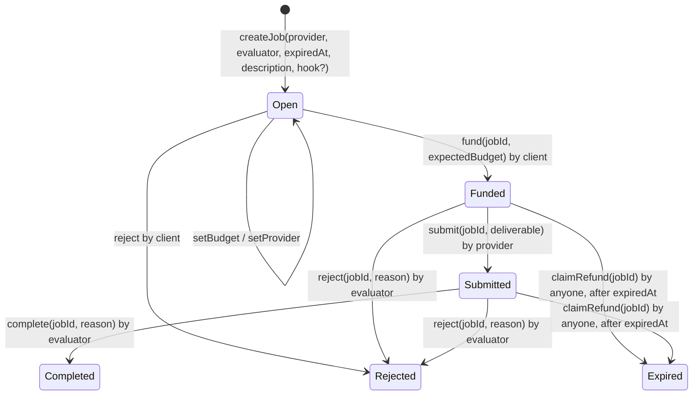

# Spike: agent commerce standards (ERC-8183, ERC-8004) and puls3 alignment

- **Issue:** none yet (product owner directive, 2026-09-30) · **Related issues:** #55 escrow contract, #8 API contract · **Date:** 2026-09-30
- **Decision record:** [ADR-0005](../adr/0005-align-agent-commerce-with-erc-8183-and-erc-8004.md) (Accepted 2026-10-02; D3 timeout values deferred)
- **Status of this document:** research kept as of 2026-09-30. Open questions, options and roadmap steps that ADR-0005 resolved are marked "Resolved by ADR-0005 D*n*"; the decisions themselves live in the ADR.

This document lives in `docs/spikes/` because in this repo every ADR's **Research** link points to a spike that holds the evidence (see [ADR-0002](../adr/0002-agent-registry-on-soroban.md), [ADR-0003](../adr/0003-payment-rail-and-custody.md), [ADR-0004](../adr/0004-agent-manifest-and-deployment.md)). The roadmap ([§8](#8-steps-to-match-or-exceed-the-standard)) is kept here and not in the ADR: an ADR records one decision and its consequences, while the roadmap is an ordered plan that will be updated as issues land.

## Question

> "puls3 must not diverge from the standards; otherwise people who build on us will find it hard to migrate or adapt." (product owner, 2026-09-30)

What do the equivalent agent platforms on other chains standardize on for hiring and paying agents, where does puls3 diverge, and what concrete steps make puls3 work the same as those platforms, and better where the evidence allows?

**Evidence labels.** **V** = verified in a primary source listed in [Sources](#sources), accessed 2026-09-30. **I** = inference by the authors of this document; it must be confirmed before it drives an implementation.

## Summary

- Every agent **job** platform reviewed (BNB Chain, Base, Arc) implements or follows **[ERC-8183 Agentic Commerce](https://eips.ethereum.org/EIPS/eip-8183)**: the client's USDC is held in **escrow** per job, released to the provider when an evaluator completes it, and refunded automatically on rejection or after a per-job `expiredAt`. Identity and reputation come from **ERC-8004**. Direct payment appears only for **x402 pay-per-call** (V).
- ERC-8183 is a **Draft** ERC (created 2026-02-25), like ERC-8004. Both are what builders on the other ecosystems are coding against today (V).
- On Stellar: **no ERC-8183 implementation was found**; **Stellar 8004** (Trion Labs) is a live mainnet ERC-8004 implementation; **Trustless Work** provides a Soroban USDC escrow with its own role model (V, as of 2026-09-30).
- puls3 diverges in four places: it **pays the agent wallet directly** (ADR-0003), **resolves unsettled funds by manual review** (#8, P1), runs **its own ERC-8004-style registries** with a non-drop-in write path (ADR-0002), and has **no job expiry and no evaluator** in the Hire lifecycle.
- Recommendation (in ADR-0005, Proposed): implement an **ERC-8183-conformant escrow contract on Soroban** (the first known one on Stellar), with the client as default evaluator and an APEX-style optimistic window as the next step, and decide ERC-8004 interop with Stellar 8004 explicitly. **Timeout values are not decided** ([§9](#9-open-decisions-for-the-product-owner)).
- **Outcome (ADR-0005, Accepted 2026-10-02):** option B was chosen. puls3 builds its own ERC-8183 escrow (D1) on the Stellar Elite / Serverpod / HackMeridian schedule (D2); the client is the evaluator with an optimistic approval window (D4); puls3 keeps its own registries, drop-in compatible with Stellar 8004 (D5); the Hire lifecycle maps 1:1 to ERC-8183 (D6); fee in bps, set to 0 (D7); no disputes (D8), retry (D9) or hooks (D10) in the MVP. **Timeout values remain deferred (D3).**

## 1. Equivalents of puls3 per ecosystem

| Ecosystem | Product (what a builder would compare puls3 with) | Job / payment standard | Escrow | Refund on failure or expiry | Evaluator | Identity / reputation | Status |
|---|---|---|---|---|---|---|---|
| **BNB Chain** | **BNB Agent Studio** (BNB Chain + AWS GenAI Innovation Center) on the **BNBAgent SDK** and **APEX** contracts | ERC-8183 ("ERC-8183 task interface"); x402 only for the agent's own LLM bills | Yes, APEX ERC-8183 contracts on BSC | Automatic: `claimRefund` after expiry is "non-pausable, non-hookable — the universal escape hatch"; quorum `voteReject` refunds | **OptimisticPolicy**: silence past the dispute window = implicit approval; client may `dispute()`; whitelisted voter quorum decides | ERC-8004 identity, agent wallet | Mainnet since 2026-07-01 (V) |
| **Base** | **Virtuals ACP v2** (Agent Commerce Protocol) with the **Butler** consumer UI | ACP v2 (April 2026) "implements the proposed ERC-8183" | Yes, an "intermediary escrow wallet"; funds are "not sent directly to the seller" | Automatic: on missed SLA or expiry the "escrow automatically refunds the USDC back to the buyer" ("within 5 minutes") | Buyer by default; third-party evaluator agents optional. Butler auto-retries failed jobs with the next best agent | Reviews on-chain through ERC-8004 when the provider is registered | Mainnet (V) |
| **Base (discovery)** | **Coinbase x402 Bazaar** | x402 | No | — | — | — | Discovery catalog only, not a job platform (V) |
| **Solana** | **Solana Agent Registry** (Solana Foundation) + **8004 Market** (Quantu Labs) | Mostly x402 direct pay-per-call; the Virtuals ACP v2 SDK also supports Solana jobs | Not documented for x402 | Not documented | — | ERC-8004-compatible registry; reputation through ACK kudos on ERC-8004 | Mainnet (V) |
| **Arc** (Circle L1, mainnet 2026-09-16) | **Circle Agent Stack** (Agent Wallets, Nanopayments, CLI, emerging Agent Marketplace; launched 2026-05-11) | ERC-8183 on Arc (tutorials on testnet) | Yes, ERC-8183 job escrow | Per ERC-8183 (`claimRefund` after expiry) | Client is also evaluator in the tutorial | ERC-8004 on Arc; "agent owners cannot record reputation for their own agents" | Mainnet chain; ERC-8183 tutorial on testnet (V) |
| **Stellar** | **puls3** (target) | Direct USDC SAC transfer to the agent's muxed address (ADR-0003) | **No** | **Manual operator review** (#8, P1) | **None** | Own ERC-8004-aligned registries (ADR-0002), non-drop-in | Testnet MVP, in progress |

Circle also publishes a **Refund Protocol** (arbiter-based, non-custodial refunds). It is **unaudited** and its own repository warns of an arbiter-drain issue, so it is **not recommended** as a building block (V).

## 2. ERC-8183 in brief

[ERC-8183: Agentic Commerce](https://eips.ethereum.org/EIPS/eip-8183) (Draft, created 2026-02-25) defines a per-job escrow with three roles: **client** (pays), **provider** (does the work), **evaluator** (accepts or rejects). All points below are V.

| Function | Caller | State |
|---|---|---|
| `createJob(provider, evaluator, expiredAt, description, hook?)` | Client | creates `Open` |
| `setProvider(jobId, provider)` | Client | `Open` |
| `setBudget(jobId, amount, optParams?)` | Client or provider | `Open` |
| `fund(jobId, expectedBudget, optParams?)` | Client | `Open` |
| `submit(jobId, deliverable, optParams?)` | Provider | `Funded` |
| `complete(jobId, reason, optParams?)` | Evaluator | `Submitted` |
| `reject(jobId, reason, optParams?)` | Client in `Open`; evaluator in `Funded` or `Submitted` | `Open`, `Funded`, `Submitted` |
| `claimRefund(jobId)` | **Anyone** | `Funded` or `Submitted`, once `expiredAt` has passed |

Key rules:

- **Expiry:** `expiredAt` is set per job by the caller. The standard has **no default value**. `claimRefund` is "deliberately not hookable so that refunds cannot be blocked".
- **Evaluator:** can be the client itself ("evaluator = client at creation"), a third party, or a contract.
- **Audit trail:** `complete` and `reject` carry a `reason` (`bytes32`, or an attestation hash) so outcomes compose with reputation systems.
- **Fees:** only on completion, deducted from the escrow before the provider is paid. No fee on refunds.
- **ERC-8004:** implementations are RECOMMENDED to integrate ERC-8004 so job outcomes feed trust signals; hooks may call it, and evaluators may post proof to the ERC-8004 Validation Registry.

## 3. How the peers parameterize ERC-8183

| Aspect | BNB APEX | Virtuals ACP v2 | Arc tutorial |
|---|---|---|---|
| States | ERC-8183 | `open → budget_set → funded → submitted → completed \| rejected \| expired` | ERC-8183 |
| `expiredAt` | Caller-set; SDK example now + 65 min, "illustrative, not a protocol default" | now + offering `slaMinutes` (example now + 3600 s) | now + 3600 s |
| `fund()` after expiry | Reverts | — | — |
| Evaluator | Optimistic: silence past the dispute window approves; client `dispute()`; voter quorum `voteReject` refunds | Buyer by default; optional evaluator agents | Client |
| Refund | `claimRefund`, non-pausable, non-hookable | Automatic, "within 5 minutes" | `claimRefund` |
| Fee | Basis points, only on `complete` | — | Deducted before the provider is paid |
| Failure UX | — | Butler retries with the next best agent | — |

All cells V; "—" means not found in the sources read.

## 4. Stellar landscape (2026-09-30)

| Project | What it is | Relevance to puls3 |
|---|---|---|
| ERC-8183 on Stellar/Soroban | **No implementation found** (Stellar Raven search, 2026-09-30) | Not found in these sources is not proof of absence, but it makes a puls3 contract a likely **first ERC-8183 reference on Stellar** (I) |
| [**Stellar 8004**](https://github.com/trionlabs/stellar-8004) (Trion Labs) | Live mainnet Soroban implementation of the ERC-8004 Identity, Reputation and Validation registries, with a TypeScript SDK, indexer and explorer. Last commit 2026-07-23. Mainnet contract `CBGPDCJIHQ32G42BE7F2CIT3YW6XRN5ED6GQJHCRZSNAYH6TGMCL6X35` per stellar.expert | The ERC-8004 reference on Stellar. ADR-0002 aligns with a subset but is not drop-in; puls3 agents do not appear in its explorer or tools (V) |
| [**Trustless Work**](https://github.com/Trustless-Work/trustlesswork-smart-contract-stellar) | Soroban USDC escrow with dispute roles. V1 on mainnet, V2 in beta on testnet | A possible base for escrow. Its interface is its own role model, not ERC-8183 (I: follows from no ERC-8183 implementation being found) |
| **x402 on Stellar** | Facilitators (OpenZeppelin Channels, x402.org testnet, self-hosted). The client signs only SAC **authorization entries**; the facilitator submits | Same shape as puls3's server relay (#8, Decision A) (V) |
| **Anchor Platform** SEP-24 / SEP-6 | `user_action_required_by` expires transactions the user abandoned | Stellar precedent for an explicit deadline on unfinished user actions (V) |

## 5. Recurring patterns

| # | Pattern | Evidence |
|---|---|---|
| 1 | **Escrow whenever there is a job.** Direct payment only for x402 pay-per-call | V (BNB, Virtuals, Arc, ERC-8183; Solana x402) |
| 2 | **One `expiredAt` per job, no protocol default.** Examples: 1 h, 65 min, SLA-bound | V |
| 3 | **Funding reverts after expiry**, so an abandoned unpaid job cannot be paid late | V (APEX) |
| 4 | **Permissionless `claimRefund` after expiry**, which no hook or pause can block | V (ERC-8183, APEX) |
| 5 | **Evaluator defaults to the client**, upgradeable to a third party, or to an optimistic window plus quorum | V |
| 6 | **Fees only on completion** | V (ERC-8183, APEX, Arc) |
| 7 | **Automatic on-chain refunds.** None of these platforms documents manual refunds | V for automatic refunds; "none manual" = not found in these sources |
| 8 | **Expired is kept separate from rejected and cancelled**, and outcomes carry a reason hash | V (ERC-8183, ACP v2 states) |
| 9 | **ERC-8004 for identity and reputation**, with reviews tied to jobs where the provider is registered | V (Virtuals, Arc, BNB) |

## 6. puls3 gap analysis

| # | Divergence | Current puls3 decision | Standard / peers | Impact on builders who migrate | Severity (I) |
|---|---|---|---|---|---|
| G1 | **Direct payment, no escrow** | ADR-0003 decision 1 ("no escrow in the MVP"); vision §6 Out item 5; ADR-0001 alternative 3 | ERC-8183 escrow per job (patterns 1, 4) | A builder coming from APEX or ACP expects `createJob/fund/submit/complete` and escrow events. On puls3 they get a SAC transfer to an `M…` address and server-side verification: different integration code, and consumers bear the risk of a paid job that fails | High |
| G2 | **Manual refunds** | #8 open question P1: unsettled funds go to off-app operator review; `failed` has no refund (hire lifecycle, open question 3) | Automatic on-chain refunds; permissionless `claimRefund` (patterns 4, 7) | Consumers and integrators cannot rely on a protocol guarantee; refunds depend on puls3's operators. Agents built for ACP assume the escrow refunds without them | High |
| G3 | **No job expiry** | Hire lifecycle open questions 1–2; #8 P2 (abandonment window, recommended 24 h, undecided); #20 runtime timeout | One `expiredAt` per job; `fund` reverts after it (patterns 2, 3) | No standard field to map SLAs onto; timeouts live in three places (P2, #20, a future dispute window) instead of one job property | Medium |
| G4 | **No evaluator** | `delivered → rated`: the consumer's rating is the only post-delivery step; there is no accept/reject that moves money | Evaluator `complete`/`reject` with a reason hash (patterns 5, 8) | Third-party evaluator agents (ACP) and optimistic policies (APEX) have no place to plug in. `rated` mixes acceptance with reputation | Medium |
| G5 | **Own ERC-8004-style registries, not drop-in** | ADR-0002: own Identity and Reputation registries, aligned with a Stellar 8004 subset; payment-backed `give_feedback` changes the signature and `NewFeedback` event | ERC-8004; Stellar 8004 is live on mainnet with SDK, indexer and explorer | ERC-8004 tools (Stellar 8004 explorer, stellar-agent-search) do not see puls3 agents; clients need a puls3 adapter (ADR-0002 consequences) | Medium |
| G6 | **Trusted feedback authorizer** | ADR-0002: the registry "does not prove that the identifier represents a real payment"; the Serverpod authorizer is trusted | ERC-8183 `complete`/`reject` reason hashes and hooks give an on-chain job record reputation can reference | Reputation cannot be verified from the chain alone | Low (MVP), rises on mainnet |

What is **already aligned** and should be kept: USDC as the settlement asset; the ERC-8004 identity/reputation model and reserved `agentWallet` (ADR-0002); "the one who hires is the one who pays and rates" (hire lifecycle, matches ERC-8183's client role and ERC-8004's no-self-feedback rule); the server relay (#8, Decision A), which is the same shape as Stellar x402 facilitators.

## 7. Where puls3 can do better than the peers

Only claims with evidence are listed. Each needs a proof in its owning issue before it goes in a pitch.

| # | Opportunity | Evidence | Label |
|---|---|---|---|
| B1 | **First ERC-8183 reference on Stellar/Soroban.** Builders from BNB, Base and Arc could reuse their job code on Stellar | No implementation found on 2026-09-30 | I (absence not provable) |
| B2 | **Faster settlement and refunds.** Ledgers close in about 5 s (ADR-0002 TTL constants); USDC on Stellar settles "in seconds with finality" (vision §4). A refund can be claimed and final one ledger after `expiredAt`, versus ACP's documented "within 5 minutes" | V for Stellar figures and ACP wording; the comparison is I until measured | I |
| B3 | **Consumers need no XLM for fees.** The consumer signs only Soroban authorization entries; the server relay is the transaction source and pays the fee, as x402 facilitators on Stellar do. Freighter auth-entry signing (`ADDRESS_V2`) is proven on testnet by #68 | V for the building blocks (#68, x402 facilitators); the escrow flow itself is I. Fee-bump binding is still open in #69 | I |
| B4 | **Refunds that do not depend on anyone remembering.** Keep `claimRefund` permissionless (pattern 4) **and** have the server tracker call it as soon as a job expires, so refunds are automatic like ACP and unblockable like APEX | Tracker design exists in #8 (Decision A) | I |
| B5 | **Contract-verified, payment-backed reputation.** Replace ADR-0002's trusted feedback authorizer with a check that the escrow job for `hire_id` reached `Completed` (or `Rejected`) for this client and agent. None of the reviewed sources documents one-job-one-review enforced by contract | ADR-0002 invariant; ERC-8183 reason hashes; peer behavior not found in these sources. **Superseded by ADR-0005 D5:** the paid-hire rule leaves the Reputation Registry; readers filter feedback by clients with a completed escrow job, keeping the registry drop-in with Stellar 8004 | I |
| B6 | **Per-job reconciliation for agents through muxed ids.** Protocol 23 / CAP-67 lets SAC `transfer` send to a `MuxedAddress` and emits `to_muxed_id` (#68 spike, verified on testnet). A release from escrow to `M…(agent wallet, job id)` would let agent-side accounting match each payout to its job from one event | V for SAC behavior; a contract-initiated muxed transfer is I until tested | I |
| B7 | **x402 compatibility for pay-per-call.** Use ERC-8183 for jobs and x402 for per-request agent APIs, as BNB (LLM bills) and Solana do. The relay already matches the Stellar facilitator shape | V (patterns 1, §4) | V/I |
| B8 | **Dart and Flutter tooling.** Existing Stellar 8004 tooling is TypeScript (vision §5); a Dart client for ERC-8183 on Soroban would be new | V for the TypeScript tooling | V |

## 8. Steps to match or exceed the standard

Ordered by dependency. "Area" follows the repo's issue labels. Issue numbers are existing issues from `gh issue list --state all` (read 2026-09-30); "new" means no issue covers it yet. ADR-0005 option B was accepted on 2026-10-02 (D1), so steps 3–11 apply. The **Status** column records which ADR-0005 decision resolved each step; "Resolved" means the decision is taken, not that the work is done.

| # | Step | Area | Issues | Status |
|---|---|---|---|---|
| 1 | **Decide ADR-0005** (option and sequencing against the Serverpod deadline of 2026-10-14) and file the follow-up issues below | docs | new | Decision resolved by ADR-0005 D1, D2; follow-up issues still to file |
| 2 | **Map the Hire lifecycle to ERC-8183 job states and evaluate the domain change.** Proposed mapping below. Evaluate adding `completed`, `rejected` (after payment, refunded), and `expired` (refunded); keep `inProgress` as an off-chain sub-state of `Funded`; make rating a separate step after `completed` or `rejected` instead of the lifecycle's final state | backend (domain), docs | #10 (closed, follow-up), new | Resolved by ADR-0005 D6: domain change over adapter-only mapping; states `open`, `funded`, `submitted`, `completed`, `rejected`, `expired`; `inProgress` and rating leave the lifecycle |
| 3 | **Specify and build the ERC-8183 escrow contract on Soroban** (`contracts/agentic-commerce/` or the name #55 chooses): same function names, argument order and state names as ERC-8183 in snake_case, typed errors, events per transition, USDC SAC only, fees only on `complete`, permissionless non-hookable `claim_refund`, `fund` fails after `expired_at`. Publish it as a reference with its interface in an ADR, like ADR-0002 did for registries | contracts | #55 | Resolved by ADR-0005 D1 (own contract), D2 (testnet by 2026-10-10), D7 (fee in bps, 0), D10 (empty hook only) |
| 4 | **Evaluator model:** client as default evaluator (ERC-8183 and ACP default) for the first version; design an APEX-style optimistic window (silence = approval, client `dispute`) as the next version so an absent consumer does not freeze the provider's funds. Third-party evaluators stay possible through the `evaluator` address | contracts, backend | #55, #20, new | Resolved by ADR-0005 D4 (client evaluator with the auto-approval window, both for Stellar Elite). There is no client `dispute` in the MVP (D8) |
| 5 | **Expiry model:** one `expired_at` per job, set by the server when it prepares `create_job`; it subsumes the unpaid-hire window (#8 P2) and bounds the runtime timeout (#20). **Values are TBD** ([§9](#9-open-decisions-for-the-product-owner), D3) | backend, contracts | #8, #19, #20, #55 | Structure resolved by ADR-0005 D1; **values deferred (D3)** |
| 6 | **Automatic refunds:** the server tracker calls `claim_refund` when a funded job expires and `reject` (as evaluator or on the evaluator's instruction) when the runtime fails; the app shows refund status. Manual review (#8 P1) shrinks to funds sent outside the escrow | backend, frontend | #19, #20, #28, #8 | Resolved by ADR-0005 D1: runtime failure is refunded by the client's `reject` (primary) or by `claim_refund` after expiry (fallback); the server cannot `reject` under a client evaluator (D4). D4 adds the invariant that auto-approval precedes expiry |
| 7 | **Adjust the #8 API contract:** the payment becomes `fund` on the escrow (consumer signs an auth entry, relay submits); replace the six-check SAC verification with reading the job state and events; add evaluator actions (`prepareComplete`/`prepareReject` or an optimistic timer), refund states on `HireDetail`, and new outcome codes. Streaming rule (Decision B) is unaffected | docs, backend | #8, #19 | Required by ADR-0005 D1, D4, D6; work pending |
| 8 | **Amend ADR-0003** (rail, verification, signer table) and the vision's Out list through ADR-0005's acceptance; record the escrow contract id per network | docs, backend | #30, ADR-0003 follow-up | Amendments listed in ADR-0005; ADR-0003 and ADR-0002 amendments pending |
| 9 | **Reputation link:** feedback authorization reads the escrow job instead of trusting the server authorizer (B5), or the escrow's completion hook calls the Reputation Registry's authorization. Record the ERC-8183 `reason` hash alongside the feedback | contracts, backend | #14, #21, #11 | Resolved by ADR-0005 D5 (paid-hire rule leaves the registry; readers filter by completed escrow jobs) and D10 (no completion hook; side effects run in the server). D8: rejects from `submitted`, with their reason hashes, feed client-side reputation |
| 10 | **ERC-8004 interop decision with Stellar 8004** (D5): at minimum, make puls3 agents discoverable by ERC-8004 tools (index request to Trion Labs or dual registration); evaluate whether to register identities directly in Stellar 8004 now that it is live on mainnet, keeping puls3's escrow-backed reputation rule | contracts, docs | #13 (closed), #14, #15, #17 | Resolved by ADR-0005 D5: own deployments with an interface identical to Stellar 8004; #14 redesign and #13 drop-in review follow |
| 11 | **Wallet and fee sponsorship:** consumer signs auth entries for `create_job`/`fund`/`complete`; server relay pays fees (B3). Close #69's fee-bump binding first | frontend, backend | #25, #28, #69 | Open (not a product decision) |
| 12 | **Better-than proofs:** measure refund latency on testnet (B2), test a contract-initiated SAC transfer to a muxed address (B6), and document an x402 path for agent APIs (B7) | contracts, backend, docs | #15, #52, #42, new | Open |
| 13 | **Deploy and seed** the escrow contract with demo jobs; show create → fund → submit → complete and one expiry refund on an explorer | contracts | #15, #42, #52 | Open; escrow on the main hire path for the Serverpod demo (ADR-0005 D2) |

**Hire ↔ ERC-8183 mapping (step 2). Resolved by ADR-0005 D6;** the table below is the original proposal, with the decided states added:

| puls3 today | ERC-8183 | Notes | Decided state (ADR-0005 D6) |
|---|---|---|---|
| `requested` | `Open` (budget set to the agent's price) | puls3 prices are fixed by the manifest, so the budget is known at creation | `open` |
| `requested --cancel--> cancelled` | `Open --reject (client)--> Rejected` | ERC-8183 has no separate "cancelled"; puls3 may keep the name in the domain and map it | `rejected` (`cancelled` removed). The hire records that it was rejected from `open`; the UI labels it "Cancelled" |
| `paid` | `Funded` | Funds held by the escrow, not the agent wallet | `funded` |
| `inProgress` | `Funded` (off-chain sub-state) | No on-chain transaction needed | Not a state: the hire stays `funded`. Runtime progress (`queued`/`running`/`failed`) is separate data for F6 polling and the server tracker |
| `delivered` | `Submitted` | `submit` carries a hash of the result | `submitted` (awaiting evaluation) |
| — (missing) | `Completed` | Evaluator accepts; escrow pays the agent minus fees | `completed` (terminal) |
| `failed` | `Rejected` (evaluator) or `Expired` (`claimRefund`) | Both refund the consumer; keep them distinct (pattern 8) | `rejected` or `expired` (terminal); `failed` removed |
| `rated` | — (ERC-8004 feedback) | Reputation is a separate registry write after `Completed`/`Rejected` | Not a state: rating is separate ERC-8004 feedback, kept on the hire as data (for example, a feedback reference) |

Principle (ADR-0005 D6): the Hire lifecycle mirrors the ERC-8183 escrow 1:1; off-chain facts (runtime progress, feedback, rejected-from state) are separate data.

## 9. Open decisions for the product owner

The product owner decided D1, D2 and D4–D10 on 2026-09-30; ADR-0005 records them (Accepted 2026-10-02). D3 stays deferred. The options are kept as researched; the **Resolution** column summarizes the outcome, and the ADR is authoritative.

| # | Decision | Options | Notes | Resolution |
|---|---|---|---|---|
| D1 | **ADR-0005 option** | A keep direct pay + manual review · B own ERC-8183 escrow · C build on Trustless Work | Recommendation: B | Resolved by ADR-0005 D1: **B**, own ERC-8183 escrow (#55) |
| D2 | **Sequencing** | Escrow before the Serverpod demo (2026-10-14) or after it, keeping ADR-0003's direct rail for that demo | The Serverpod demo judges the Serverpod stack; the Stellar evaluations judge Soroban work | Resolved by ADR-0005 D2: contract on testnet for Stellar Elite (2026-10-10); escrow on the main hire path in the Serverpod demo (2026-10-14); remaining pieces by HackMeridian (2026-10-25) |
| D3 | **Timeout values — explicitly deferred** | Job `expired_at` (delivery SLA); unpaid-job expiry (#8 P2, recommended 24 h there, not decided); runtime timeout (#20); optimistic approval window | Peers use examples only (1 h, 65 min, SLA-bound) | **Deferred** (ADR-0005 D3). D1 is decided; the values are not |
| D4 | **Evaluator default** | Explicit client approval · optimistic window (silence = approval) · third-party evaluator agent | Affects UX when the consumer never returns | Resolved by ADR-0005 D4: the client, who can `complete` or `reject`; silence past an approval window = implicit approval. The window ships with the escrow for Stellar Elite (moved forward from HackMeridian on 2026-10-02) |
| D5 | **ERC-8004 interop** | Keep own registries + adapter (ADR-0002) · dual-register in Stellar 8004 · adopt Stellar 8004 identity and keep puls3 reputation rule | ADR-0002 rejected adopting Stellar 8004 for reasons partly tied to the hackathons (own contract, admin keys, feedback invariant) | Resolved by ADR-0005 D5: own deployments with an interface identical (drop-in) to Stellar 8004; paid-hire rule proven by a completed escrow job, not by the registry |
| D6 | **Domain change** | Add `completed`/`rejected`/`expired` and move rating out of the lifecycle · map only at the adapter | #10 is closed; a change reopens the domain contract | Resolved by ADR-0005 D6: domain change; states mirror ERC-8183 (`open`, `funded`, `submitted`, `completed`, `rejected`, `expired`); `inProgress`, `cancelled`, `failed` and `rated` leave the lifecycle |
| D7 | **Platform fee** | None · basis points on `complete` only | ERC-8183 allows fees only on completion | Resolved by ADR-0005 D7: fee in bps plus fee recipient, only on `complete`; 0 bps for the MVP |
| D8 | **Disputes** | None in MVP · operator as evaluator of last resort · voter quorum (APEX) | Vision lists disputes as Out | Resolved by ADR-0005 D8: none in the MVP; the client's `reject` is final and on-chain; only rejects from `submitted` count toward client-side reputation. Scaling path (operator arbiter or voter quorum) remains open |
| D9 | **Retry with another agent** | None · offer · automatic (Butler) | Product choice, no standard requirement | Resolved by ADR-0005 D9: none in the MVP; the client picks another agent manually |
| D10 | **Hooks** | Not supported · supported with the non-hookable refund rule | ERC-8183 makes hooks optional | Resolved by ADR-0005 D10: `hook` parameter kept, only an empty hook accepted; `claim_refund` stays non-hookable |

## Sources

All accessed 2026-09-30.

- ERC-8183 Agentic Commerce: https://eips.ethereum.org/EIPS/eip-8183
- ERC-8004 Trustless Agents: https://eips.ethereum.org/EIPS/eip-8004
- BNB Agent Studio: https://www.bnbchain.org/en/blog/bnb-agent-studio-is-live-on-bnb-chain-ai-agents-from-one-prompt
- BNBAgent SDK mainnet: https://www.bnbchain.org/en/blog/bnbagent-sdk-is-now-live-on-bnb-chain-mainnet-the-modular-standard-for-identity-commerce-payment-and-memory-in-ai-agents
- BNBAgent SDK (`ARCHITECTURE.md`, `python/README.md`): https://github.com/bnb-chain/bnbagent-sdk
- APEX contracts: https://github.com/bnb-chain/apex-contracts
- Virtuals ACP changelog: https://whitepaper.virtuals.io/acp/acp-changelogs
- Virtuals whitepaper (full text): https://whitepaper.virtuals.io/llms-full.txt
- Virtuals ACP Node v2 SDK: https://github.com/Virtual-Protocol/acp-node-v2
- Virtuals ACP CLI: https://github.com/Virtual-Protocol/acp-cli
- Coinbase x402 Bazaar: https://docs.cdp.coinbase.com/x402/bazaar
- Solana Agent Registry: https://solana.com/agent-registry
- 8004 Market: https://8004market.io/
- x402 on Solana: https://solana.com/docs/payments/agentic-payments/x402
- Arc agentic economy: https://docs.arc.io/build/agentic-economy
- Arc ERC-8183 tutorial: https://docs.arc.io/arc/tutorials/create-your-first-erc-8183-job.md
- Arc ERC-8004 tutorial: https://docs.arc.io/arc/tutorials/register-your-first-ai-agent.md
- Circle AI infrastructure launch: https://www.circle.com/pressroom/circle-launches-ai-infrastructure-to-power-the-agentic-economy
- Arc mainnet launch: https://www.circle.com/pressroom/circle-launches-arc-mainnet-an-economic-operating-system-for-the-internet
- Circle Refund Protocol: https://github.com/circlefin/refund-protocol
- Stellar 8004: https://github.com/trionlabs/stellar-8004 (mainnet contract `CBGPDCJIHQ32G42BE7F2CIT3YW6XRN5ED6GQJHCRZSNAYH6TGMCL6X35`, per stellar.expert)
- Trustless Work escrow: https://github.com/Trustless-Work/trustlesswork-smart-contract-stellar
- x402 on Stellar: https://developers.stellar.org/docs/build/agentic-payments/x402
- Internal: [ADR-0002](../adr/0002-agent-registry-on-soroban.md), [ADR-0003](../adr/0003-payment-rail-and-custody.md), [hire lifecycle](../domain/hire-lifecycle.md), [vision](../vision.md), #8 API contract draft (provisional, not merged), #68 Flutter wallet spike (not merged)
